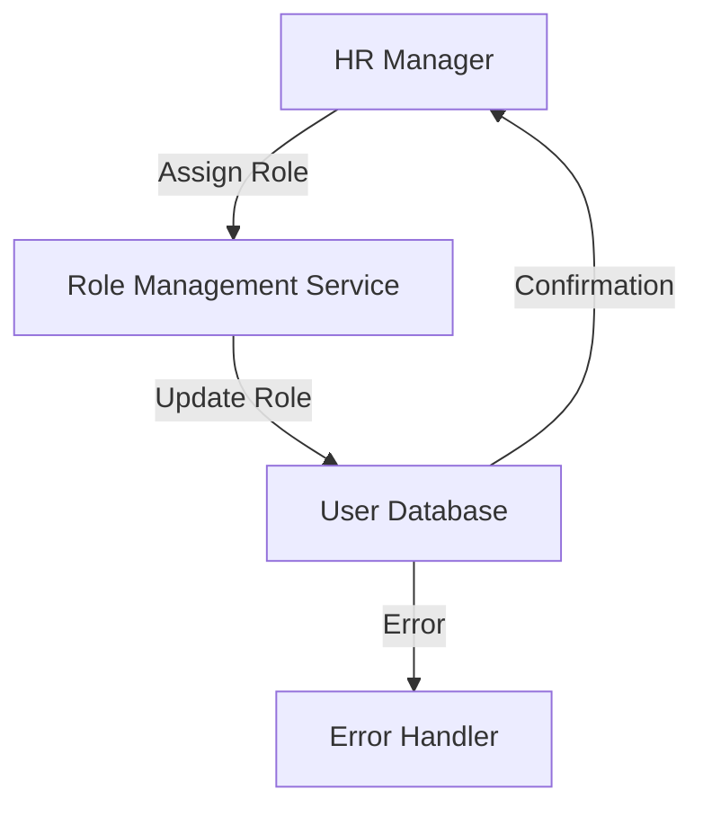
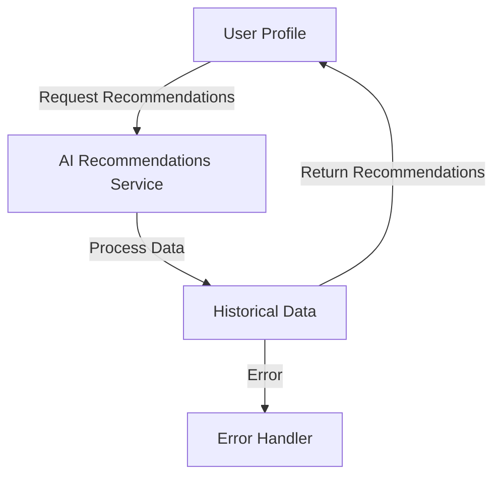
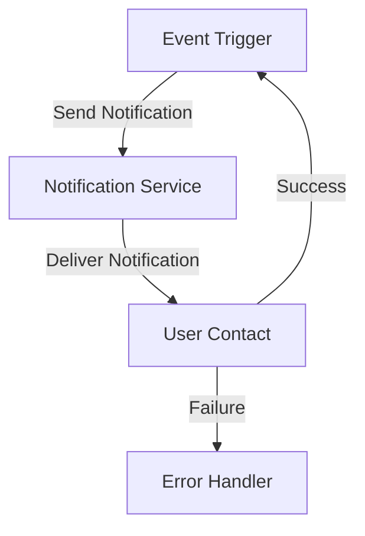
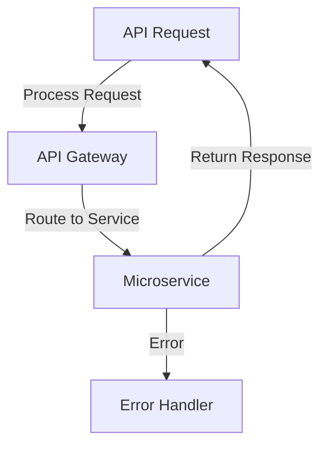
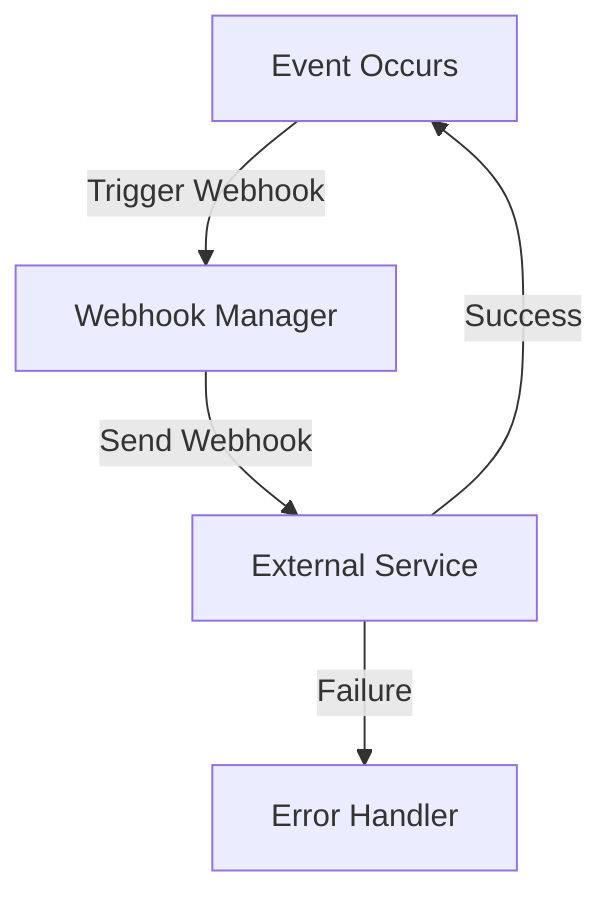

# AI Workforce Operating System — Build Guide

**Version:** v1  
**Date:** 2026-04-29  
**Status:** Final  

---

# Chapter 1: Executive Summary

> **Chapter purpose**: This chapter provides the design intent and implementation guidance for Executive Summary. The first step is understanding the inputs and outputs, then identifying dependencies and prerequisites before implementation.

# Chapter 1: Executive Summary

## Vision & Strategy

The vision for this project is to develop a cloud-based AI-driven staffing solution that addresses the prevalent issue of staffing inefficiencies faced by HR managers across various industries. The strategy involves leveraging autonomous intelligence to enhance workforce management processes, thereby increasing operational efficiency and reducing costs. This chapter outlines the key components of our vision and strategy, including the problem we aim to solve, our target users, and the value proposition we offer.

### Problem Statement
Staffing inefficiencies manifest in various forms, such as overstaffing, understaffing, and ineffective scheduling. These issues lead to increased operational costs, reduced employee morale, and ultimately, a negative impact on organizational performance. HR managers often struggle to allocate resources effectively, especially in dynamic environments where demand fluctuates.

### Target Users
Our primary target users are HR managers who are responsible for workforce planning and management. These professionals require tools that can provide real-time insights into staffing needs, automate scheduling processes, and facilitate data-driven decision-making. By focusing on this user group, we aim to create a solution that directly addresses their pain points and enhances their operational capabilities.

### Value Proposition
The proposed solution offers a unique value proposition by combining advanced AI capabilities with user-friendly interfaces. Key benefits include:
- **Increased Efficiency**: Automating routine tasks such as scheduling and staff allocation allows HR managers to focus on strategic initiatives.
- **Data-Driven Insights**: Real-time analytics and reporting features empower HR managers to make informed decisions based on accurate data.
- **Seamless Integration**: The solution will integrate with existing HR systems, ensuring a smooth transition and minimal disruption to current workflows.

### Strategic Goals
The strategic goals for this project include:
1. **Developing Core AI Features**: Focus on building the minimum viable product (MVP) that includes essential AI-driven functionalities.
2. **Ensuring Compliance**: Adhere to labor laws and regulations to protect user data and maintain trust.
3. **Achieving High Availability**: Design the system to be reliable and accessible, ensuring that HR managers can access the platform whenever needed.
4. **Implementing a Subscription Model**: Create a monetization strategy that offers various subscription tiers to cater to different organizational sizes and needs.

In summary, this section outlines the vision and strategy for the AI-driven staffing solution, emphasizing the importance of addressing staffing inefficiencies through innovative technology. The goal is to empower HR managers with the tools they need to optimize workforce management and improve overall organizational performance.

## Business Model

The business model for the AI-driven staffing solution is built around a subscription-based framework that offers multiple tiers of service. This model is designed to generate recurring revenue while providing flexibility to our users. The following sections detail the components of the business model, including pricing strategies, customer acquisition, and revenue streams.

### Subscription Tiers
The subscription model will consist of three tiers:
1. **Basic Tier**: This entry-level plan will provide access to core features such as role management, basic AI recommendations, and standard reporting. It is designed for small organizations with limited staffing needs.
2. **Professional Tier**: This mid-level plan will include additional features such as advanced AI recommendations, usage analytics, and API access for third-party integrations. It targets medium-sized organizations that require more robust staffing solutions.
3. **Enterprise Tier**: This top-tier plan will offer all features, including advanced performance monitoring, time-series forecasting, and dedicated support. It is tailored for large organizations with complex staffing requirements.

### Pricing Strategy
The pricing strategy will be competitive, taking into account market research and analysis of similar solutions. The following pricing structure is proposed:
- **Basic Tier**: $29/month per user
- **Professional Tier**: $79/month per user
- **Enterprise Tier**: $149/month per user

Discounts will be offered for annual subscriptions, incentivizing long-term commitments from customers. Additionally, a free trial period of 14 days will be provided to allow potential users to experience the platform's capabilities before committing to a subscription.

### Customer Acquisition
To acquire customers, the following strategies will be employed:
- **Digital Marketing**: Utilize SEO, content marketing, and social media advertising to reach HR managers and decision-makers in target industries.
- **Partnerships**: Collaborate with HR consulting firms and industry associations to promote the solution and gain credibility.
- **Webinars and Demos**: Host online demonstrations and webinars to showcase the platform's features and benefits, allowing potential customers to see the value firsthand.

### Revenue Streams
In addition to subscription fees, additional revenue streams will be explored:
- **Consulting Services**: Offer consulting services to help organizations implement the solution effectively and optimize their staffing processes.
- **Training Programs**: Develop training programs and resources to educate users on best practices for utilizing the platform.
- **Add-On Features**: Provide optional add-on features, such as advanced analytics or custom reporting, for an additional fee.

In conclusion, the business model for the AI-driven staffing solution is designed to provide value to users while generating sustainable revenue for the organization. By offering flexible subscription tiers and additional services, we aim to meet the diverse needs of our target market and establish a strong foothold in the HR technology landscape.

## Competitive Landscape

Understanding the competitive landscape is crucial for positioning our AI-driven staffing solution effectively. This section analyzes key competitors, their strengths and weaknesses, and identifies opportunities for differentiation.

### Key Competitors
1. **Workday**: A leading provider of cloud-based HR solutions, Workday offers comprehensive workforce management features, including staffing and scheduling tools. Strengths include a strong brand reputation and extensive integrations. However, its pricing may be prohibitive for smaller organizations.
2. **ADP Workforce Now**: This platform provides a suite of HR services, including payroll and staffing solutions. ADP's strengths lie in its established customer base and robust compliance features. However, its user interface can be complex, leading to a steeper learning curve for new users.
3. **BambooHR**: Targeted at small to medium-sized businesses, BambooHR offers user-friendly HR management tools. Its strengths include ease of use and affordability. However, it lacks advanced AI capabilities, which presents an opportunity for our solution to stand out.
4. **Shiftboard**: This platform specializes in workforce scheduling and management, particularly for industries with fluctuating staffing needs. While it excels in scheduling, it does not offer comprehensive HR features, creating a gap that our solution can fill.

### Strengths and Weaknesses
- **Strengths of Competitors**:
  - Established brand recognition and customer loyalty.
  - Comprehensive feature sets that cover various HR functions.
  - Strong compliance and security measures.

- **Weaknesses of Competitors**:
  - High pricing structures that may deter smaller organizations.
  - Complex user interfaces that can lead to user frustration.
  - Limited AI-driven functionalities that do not leverage real-time data effectively.

### Opportunities for Differentiation
To differentiate our solution in the competitive landscape, we will focus on the following strategies:
- **User-Centric Design**: Prioritize a user-friendly interface that simplifies navigation and enhances the overall user experience. This will reduce the learning curve and increase user adoption rates.
- **Advanced AI Capabilities**: Leverage autonomous intelligence to provide real-time insights, predictive analytics, and personalized recommendations that competitors do not offer.
- **Flexible Pricing Model**: Implement a competitive pricing strategy that caters to organizations of all sizes, making our solution accessible to a broader audience.
- **Seamless Integration**: Ensure that our solution integrates easily with existing HR systems, reducing friction during implementation and enhancing overall value.

In summary, this section provides a comprehensive analysis of the competitive landscape, highlighting key competitors, their strengths and weaknesses, and opportunities for differentiation. By understanding the market dynamics, we can position our AI-driven staffing solution effectively and capitalize on unmet needs in the HR technology space.

## Market Size Context

The market for HR technology solutions, particularly those focused on staffing and workforce management, is experiencing significant growth. This section provides an overview of the market size, growth trends, and key drivers influencing demand for AI-driven staffing solutions.

### Market Size
According to recent industry reports, the global HR technology market is projected to reach $30 billion by 2025, growing at a compound annual growth rate (CAGR) of 10%. Within this market, the segment focused on workforce management and staffing solutions is expected to grow even faster, driven by the increasing need for organizations to optimize their workforce and improve operational efficiency.

### Growth Trends
Several trends are contributing to the growth of the HR technology market:
- **Increased Adoption of AI**: Organizations are increasingly recognizing the value of AI in enhancing decision-making processes and automating routine tasks. This trend is driving demand for AI-driven staffing solutions that can provide real-time insights and recommendations.
- **Remote Work and Flexibility**: The rise of remote work has created new challenges for workforce management, leading organizations to seek solutions that can adapt to changing staffing needs and optimize resource allocation.
- **Focus on Employee Experience**: Companies are prioritizing employee experience and engagement, leading to a demand for tools that can streamline HR processes and improve communication between HR managers and employees.

### Key Drivers
Several key drivers are influencing the demand for AI-driven staffing solutions:
- **Labor Market Dynamics**: The ongoing labor shortage in various industries is prompting organizations to seek innovative solutions for attracting and retaining talent. AI-driven staffing tools can help identify the right candidates and optimize hiring processes.
- **Data-Driven Decision Making**: Organizations are increasingly relying on data to inform their staffing decisions. AI-driven solutions that provide real-time analytics and insights are becoming essential for effective workforce management.
- **Regulatory Compliance**: Compliance with labor laws and regulations is a top priority for organizations. AI-driven staffing solutions that incorporate compliance features can help mitigate risks and ensure adherence to legal requirements.

In conclusion, the market size context highlights the significant growth potential for AI-driven staffing solutions within the broader HR technology market. By understanding the key trends and drivers influencing demand, we can position our solution effectively to capitalize on emerging opportunities.

## Risk Summary

As with any technology project, there are inherent risks associated with the development and deployment of the AI-driven staffing solution. This section outlines the key risks, their potential impact, and strategies for mitigation.

### Key Risks
1. **Data Privacy Concerns**: The handling of sensitive employee data raises concerns about privacy and compliance with regulations such as GDPR and CCPA. A data breach could lead to significant legal and financial repercussions.
2. **Dependence on Data Quality**: The effectiveness of AI-driven recommendations relies heavily on the quality of the data being processed. Poor data quality can lead to inaccurate predictions and suboptimal staffing decisions.
3. **Resistance to Change**: HR managers and employees may resist adopting new technology, particularly if they are accustomed to traditional staffing processes. This resistance can hinder user adoption and limit the solution's effectiveness.
4. **Integration Challenges**: Integrating the solution with existing HR systems may present technical challenges, leading to delays in deployment and increased costs.

### Impact Assessment
- **Data Privacy Concerns**: A data breach could result in legal penalties, loss of customer trust, and damage to the company's reputation.
- **Dependence on Data Quality**: Inaccurate predictions could lead to poor staffing decisions, resulting in increased operational costs and decreased employee satisfaction.
- **Resistance to Change**: Low user adoption rates could limit the solution's effectiveness and hinder revenue generation.
- **Integration Challenges**: Technical difficulties during integration could lead to project delays and increased costs, impacting the overall timeline and budget.

### Mitigation Strategies
To mitigate these risks, the following strategies will be implemented:
- **Data Privacy Measures**: Implement robust data security protocols, including encryption at rest and in transit, to protect sensitive information. Regular audits and compliance checks will ensure adherence to data protection regulations.
- **Data Quality Assurance**: Establish data validation and sanitization processes to ensure that only high-quality data is used for AI training and decision-making. Regular monitoring and feedback loops will help identify and rectify data quality issues.
- **Change Management Initiatives**: Develop a comprehensive change management plan that includes training programs, user support, and communication strategies to facilitate user adoption and address resistance.
- **Integration Testing**: Conduct thorough testing of integration processes to identify and resolve potential challenges before deployment. Collaborate closely with existing HR system vendors to ensure compatibility and smooth integration.

In summary, this risk summary outlines the key risks associated with the AI-driven staffing solution, their potential impact, and strategies for mitigation. By proactively addressing these risks, we can enhance the likelihood of successful project execution and deployment.

## Technical High-Level Architecture

The technical architecture of the AI-driven staffing solution is designed to support the core functionalities while ensuring scalability, reliability, and security. This section provides an overview of the high-level architecture, including key components, data flow, and technology stack.

### Architecture Overview
The architecture consists of several key components:
1. **Frontend Application**: A web-based user interface that allows HR managers to interact with the system, manage staffing processes, and access analytics.
2. **Backend Services**: A set of microservices that handle business logic, data processing, and AI model execution. Each microservice will be independently deployable and scalable.
3. **Database**: A secure database that stores user data, staffing information, and analytics. The database will implement encryption at rest to protect sensitive information.
4. **AI Engine**: A dedicated component that houses the AI models used for recommendations, forecasting, and anomaly detection. This engine will leverage machine learning frameworks to provide real-time insights.
5. **API Gateway**: An API gateway that manages external API requests, authentication, and rate limiting. This component will facilitate integration with third-party systems and services.

### Data Flow
The data flow within the architecture can be summarized as follows:
1. **User Input**: HR managers input staffing requirements, schedules, and employee data through the frontend application.
2. **Data Processing**: The backend services process the input data, validate it, and store it in the database.
3. **AI Model Execution**: The AI engine retrieves relevant data from the database, executes the appropriate models, and generates recommendations or forecasts.
4. **Output Generation**: The backend services return the results to the frontend application, where HR managers can view insights, alerts, and recommendations.

### Technology Stack
The following technology stack is proposed for the implementation of the solution:
- **Frontend**: React.js for building the user interface, ensuring a responsive and interactive experience.
- **Backend**: Node.js with Express.js for developing RESTful APIs and microservices.
- **Database**: PostgreSQL for structured data storage, with encryption at rest enabled.
- **AI Framework**: TensorFlow or PyTorch for developing and deploying machine learning models.
- **API Gateway**: Kong or Traefik for managing API traffic and ensuring secure access.

In conclusion, this technical high-level architecture outlines the key components and data flow of the AI-driven staffing solution. By leveraging a modern technology stack and implementing a microservices architecture, we can ensure scalability, reliability, and security while delivering a robust solution to our users.

## Deployment Model

The deployment model for the AI-driven staffing solution is designed to ensure high availability, scalability, and security. This section outlines the deployment strategy, including cloud infrastructure, CI/CD processes, and monitoring considerations.

### Cloud Infrastructure
The solution will be deployed on a cloud platform, such as Amazon Web Services (AWS) or Microsoft Azure, to take advantage of their scalability and reliability. Key components of the cloud infrastructure include:
- **Compute Resources**: Utilize virtual machines or container orchestration (e.g., Kubernetes) to host backend services and AI models.
- **Storage**: Implement cloud storage solutions for database backups and data archiving, ensuring data durability and availability.
- **Networking**: Configure virtual private clouds (VPCs) and security groups to control access to resources and protect sensitive data.

### CI/CD Processes
To facilitate continuous integration and deployment, the following CI/CD processes will be implemented:
1. **Version Control**: Use Git for version control, ensuring that all code changes are tracked and managed effectively.
2. **Automated Testing**: Implement automated testing frameworks to validate code changes and ensure that new features do not introduce regressions.
3. **Build Pipeline**: Set up a build pipeline using tools like Jenkins or GitHub Actions to automate the build and deployment process.
4. **Deployment Automation**: Utilize infrastructure as code (IaC) tools like Terraform or AWS CloudFormation to automate the provisioning and configuration of cloud resources.

### Monitoring and Observability
To ensure the reliability and performance of the deployed solution, comprehensive monitoring and observability practices will be implemented:
- **Application Performance Monitoring (APM)**: Use APM tools like New Relic or Datadog to monitor application performance, track latency, and identify bottlenecks.
- **Logging**: Implement centralized logging solutions (e.g., ELK Stack) to aggregate logs from all services, enabling efficient troubleshooting and analysis.
- **Alerting**: Set up alerting mechanisms to notify the DevOps team of critical issues, such as service outages or performance degradation.

In summary, this deployment model outlines the cloud infrastructure, CI/CD processes, and monitoring considerations for the AI-driven staffing solution. By leveraging cloud technologies and implementing robust deployment practices, we can ensure a reliable and scalable solution for our users.

## Assumptions & Constraints

This section outlines the key assumptions and constraints that will guide the development and deployment of the AI-driven staffing solution. Understanding these factors is essential for effective project planning and execution.

### Assumptions
1. **User Adoption**: It is assumed that HR managers will be open to adopting new technology and willing to transition from traditional staffing processes to an AI-driven solution.
2. **Data Availability**: The project assumes that organizations will provide access to relevant staffing data, including employee information, schedules, and performance metrics, to enable effective AI model training and decision-making.
3. **Integration Capability**: It is assumed that existing HR systems will have the capability to integrate with the new solution, allowing for seamless data exchange and interoperability.
4. **Regulatory Compliance**: The project assumes that the solution will comply with relevant labor laws and data protection regulations, ensuring that user data is handled securely and responsibly.

### Constraints
1. **Real-Time Data Ingestion**: The solution must be capable of ingesting and processing data in real-time to provide timely insights and recommendations. This requirement may impose limitations on data storage and processing architectures.
2. **Integration with Existing Systems**: The need to integrate with various existing HR systems may introduce technical challenges and dependencies that must be managed carefully.
3. **Compliance Requirements**: Adhering to labor laws and data protection regulations may impose additional constraints on data handling, storage, and processing practices.
4. **Resource Limitations**: Budget and resource constraints may impact the scope of features that can be developed for the MVP, necessitating prioritization of core functionalities.

In conclusion, this section outlines the key assumptions and constraints that will guide the development and deployment of the AI-driven staffing solution. By understanding these factors, we can effectively plan and execute the project, ensuring that we meet user needs while adhering to regulatory requirements and technical limitations.

---

# Chapter 2: Problem & Market Context

> **Chapter purpose**: This chapter provides the design intent and implementation guidance for Problem & Market Context. The first step is understanding the inputs and outputs, then identifying dependencies and prerequisites before implementation.

## Detailed Problem Breakdown

Staffing inefficiencies are a pervasive issue in human resource management, leading to significant operational challenges and financial burdens for organizations. The core of the problem lies in the inability to effectively match workforce supply with demand, resulting in overstaffing or understaffing scenarios. This chapter will dissect the various dimensions of staffing inefficiencies, focusing on the underlying causes, the impact on HR managers, and the broader implications for organizations.

### 1.1 Understanding Staffing Inefficiencies
Staffing inefficiencies can be categorized into several key areas:
- **Overstaffing:** This occurs when organizations maintain more employees than necessary, leading to inflated payroll costs and reduced profitability. Overstaffing can arise from poor forecasting, lack of real-time data, or rigid scheduling practices.
- **Understaffing:** Conversely, understaffing can lead to employee burnout, decreased morale, and compromised service quality. HR managers often struggle to predict peak demand periods accurately, resulting in insufficient staffing levels during critical times.
- **Ineffective Scheduling:** Traditional scheduling methods often fail to account for dynamic changes in demand, leading to rigid schedules that do not adapt to real-time needs. This inflexibility can exacerbate both overstaffing and understaffing issues.
- **Poor Communication:** Inefficient communication between departments can lead to misalignment in staffing needs. For example, if the sales team anticipates a surge in customer demand but fails to communicate this to HR, staffing levels may not adjust accordingly.

### 1.2 Impact on HR Managers
HR managers are at the forefront of addressing staffing inefficiencies, and their roles are significantly impacted by these challenges:
- **Increased Workload:** HR managers often spend excessive time manually adjusting schedules and reallocating staff, detracting from strategic initiatives.
- **Employee Satisfaction:** Inefficient staffing can lead to employee dissatisfaction, as workers may face unpredictable schedules or excessive workloads. This can result in higher turnover rates, further complicating staffing efforts.
- **Compliance Risks:** Failure to maintain appropriate staffing levels can lead to compliance issues, particularly in industries with strict labor regulations. HR managers must navigate these complexities while ensuring that staffing decisions align with legal requirements.

### 1.3 Broader Implications for Organizations
The ramifications of staffing inefficiencies extend beyond HR departments:
- **Financial Impact:** Organizations may experience increased operational costs due to overstaffing or lost revenue opportunities due to understaffing. According to industry studies, companies can lose up to 30% of their revenue due to inefficient staffing practices.
- **Reputation Damage:** Poor staffing can lead to subpar customer experiences, damaging an organization’s reputation and brand loyalty. In competitive markets, this can have long-lasting effects on customer retention.
- **Strategic Limitations:** Organizations that fail to address staffing inefficiencies may struggle to scale effectively, limiting their ability to respond to market changes and seize new opportunities.

### 1.4 Conclusion
In summary, staffing inefficiencies present a multifaceted challenge for HR managers and organizations alike. By understanding the underlying causes and implications of these inefficiencies, we can better appreciate the necessity for a robust, AI-driven solution that addresses these issues head-on. This project aims to develop a cloud-based platform that leverages autonomous intelligence to predict staffing demand, optimize workforce allocation, and generate adaptive schedules, ultimately enhancing organizational efficiency and employee satisfaction.

## Market Segmentation

The target market for our AI-driven staffing solution includes various segments within the broader human resources landscape. Understanding these segments is crucial for tailoring our product features, marketing strategies, and customer engagement approaches. This section will explore the primary market segments, their unique needs, and how our solution can address these requirements.

### 2.1 Target Market Segments
1. **Small and Medium Enterprises (SMEs):**
   - **Characteristics:** Typically have fewer than 500 employees, often with limited HR resources.
   - **Needs:** Cost-effective solutions that can automate scheduling and staffing processes without requiring extensive IT infrastructure.
   - **Solution Fit:** Our platform can provide SMEs with an affordable subscription tier that includes core AI features, enabling them to optimize staffing without significant upfront investment.

2. **Large Enterprises:**
   - **Characteristics:** Organizations with over 500 employees, often operating across multiple locations and departments.
   - **Needs:** Advanced analytics, real-time data integration, and compliance management tools to handle complex staffing needs.
   - **Solution Fit:** Our solution can offer customizable features and robust API access for integration with existing HR systems, catering to the sophisticated requirements of large enterprises.

3. **Healthcare Organizations:**
   - **Characteristics:** Hospitals and clinics that require precise staffing to meet patient care demands.
   - **Needs:** Real-time scheduling adjustments, compliance with labor laws, and the ability to respond quickly to fluctuating patient volumes.
   - **Solution Fit:** The AI-driven recommendations and performance monitoring features can help healthcare organizations maintain optimal staffing levels while ensuring compliance with regulations.

4. **Retail and Hospitality:**
   - **Characteristics:** Industries characterized by high turnover rates and variable demand patterns.
   - **Needs:** Flexible scheduling solutions that can adapt to peak seasons and special events.
   - **Solution Fit:** Our platform can provide dynamic staff allocation features and automated scheduling adjustments to meet the unique demands of retail and hospitality sectors.

5. **Government and Non-Profit Organizations:**
   - **Characteristics:** Entities that often operate under strict budget constraints and regulatory requirements.
   - **Needs:** Cost-effective staffing solutions that ensure compliance with labor laws while maximizing resource utilization.
   - **Solution Fit:** Our solution can offer audit logging and compliance features that align with the operational needs of government and non-profit organizations.

### 2.2 Market Size and Growth Potential
The global HR technology market is projected to reach $30 billion by 2025, with a significant portion attributed to staffing and workforce management solutions. The increasing adoption of AI and machine learning technologies in HR processes is driving this growth. As organizations seek to enhance efficiency and reduce costs, the demand for intelligent staffing solutions will continue to rise.

### 2.3 Conclusion
In conclusion, the market segmentation analysis highlights the diverse needs of potential users of our AI-driven staffing solution. By tailoring our product features and marketing strategies to address the specific requirements of each segment, we can position ourselves effectively within the competitive landscape and maximize our market reach.

## Existing Alternatives

In the current landscape of HR technology, several alternatives exist that aim to address staffing inefficiencies. This section will analyze these existing solutions, their strengths and weaknesses, and how our proposed platform can differentiate itself in the market.

### 3.1 Overview of Existing Solutions
1. **Traditional Scheduling Software:**
   - **Examples:** When I Work, Deputy, and Shiftboard.
   - **Strengths:** User-friendly interfaces, basic scheduling capabilities, and mobile access for employees.
   - **Weaknesses:** Limited AI capabilities, lack of real-time data integration, and insufficient adaptability to changing workforce demands.

2. **Workforce Management Systems:**
   - **Examples:** Kronos, ADP Workforce Now, and SAP SuccessFactors.
   - **Strengths:** Comprehensive features for time tracking, payroll, and compliance management.
   - **Weaknesses:** High implementation costs, complexity, and often require extensive training for users.

3. **AI-Powered Staffing Solutions:**
   - **Examples:** ShiftPixy, WorkFusion, and X0PA AI.
   - **Strengths:** Utilize AI for predictive analytics and workforce optimization.
   - **Weaknesses:** Often tailored to specific industries, which may limit applicability for broader use cases.

4. **Freelance and Gig Economy Platforms:**
   - **Examples:** Upwork, Fiverr, and TaskRabbit.
   - **Strengths:** Flexibility in staffing and access to a diverse talent pool.
   - **Weaknesses:** Lack of integration with existing HR systems and potential quality control issues.

### 3.2 Comparative Analysis
| Feature/Capability              | Traditional Scheduling | Workforce Management | AI-Powered Solutions | Gig Economy Platforms |
|----------------------------------|-----------------------|----------------------|----------------------|-----------------------|
| Real-Time Data Integration        | No                    | Limited              | Yes                  | No                    |
| Predictive Analytics              | No                    | No                   | Yes                  | No                    |
| Compliance Management             | Limited               | Yes                  | Yes                  | No                    |
| User-Friendly Interface           | Yes                   | No                   | Yes                  | Yes                   |
| Cost-Effectiveness                | Yes                   | No                   | Limited              | Yes                   |

### 3.3 Conclusion
The analysis of existing alternatives reveals a significant gap in the market for a comprehensive, AI-driven staffing solution that combines the strengths of traditional scheduling software with advanced predictive analytics and real-time data integration. Our proposed platform aims to fill this gap by offering a user-friendly interface, robust compliance features, and the ability to adapt to dynamic workforce demands, ultimately providing HR managers with the tools they need to optimize staffing efficiently.

## Competitive Gap Analysis

In order to effectively position our AI-driven staffing solution in the market, it is essential to conduct a competitive gap analysis. This analysis will identify the strengths and weaknesses of our competitors and highlight the unique value propositions that our solution offers.

### 4.1 Competitor Landscape
1. **ShiftPixy:**
   - **Strengths:** Focus on the gig economy, providing flexible staffing solutions.
   - **Weaknesses:** Limited features for traditional workforce management, primarily targeting specific industries.

2. **Kronos:**
   - **Strengths:** Comprehensive workforce management features, strong brand recognition.
   - **Weaknesses:** High costs and complexity, often requiring extensive training for users.

3. **WorkFusion:**
   - **Strengths:** Advanced AI capabilities for workforce optimization.
   - **Weaknesses:** Primarily focused on large enterprises, limiting accessibility for SMEs.

4. **Deputy:**
   - **Strengths:** User-friendly interface, mobile access for employees.
   - **Weaknesses:** Limited AI capabilities and real-time data integration.

### 4.2 Identifying Competitive Gaps
- **Lack of Real-Time Adaptability:** Many existing solutions do not offer real-time data integration, making it difficult for HR managers to respond to changing workforce demands promptly.
- **Limited Predictive Analytics:** While some competitors utilize AI, few provide comprehensive predictive analytics that can forecast staffing needs based on historical data and trends.
- **High Implementation Costs:** Many workforce management systems are prohibitively expensive for SMEs, creating a barrier to entry for smaller organizations.
- **Inflexibility in Scheduling:** Traditional scheduling software often lacks the flexibility to adapt to dynamic changes in demand, leading to inefficiencies.

### 4.3 Unique Value Proposition
Our AI-driven staffing solution will address these competitive gaps by offering:
- **Real-Time Data Integration:** Seamless integration with existing HR systems to provide real-time insights into staffing needs.
- **Advanced Predictive Analytics:** Utilizing machine learning algorithms to forecast staffing demand and optimize workforce allocation.
- **Affordable Subscription Tiers:** A pricing model that caters to organizations of all sizes, ensuring accessibility for SMEs.
- **Dynamic Scheduling Capabilities:** Automated scheduling adjustments based on real-time data, allowing for greater flexibility and responsiveness.

### 4.4 Conclusion
The competitive gap analysis underscores the need for a comprehensive, AI-driven staffing solution that addresses the shortcomings of existing alternatives. By leveraging real-time data integration, advanced predictive analytics, and a flexible pricing model, our platform is well-positioned to meet the needs of HR managers and organizations seeking to optimize their staffing processes.

## Value Differentiation Matrix

To effectively communicate the unique value proposition of our AI-driven staffing solution, we will utilize a Value Differentiation Matrix. This matrix will compare our solution against key competitors based on critical features and capabilities.

### 5.1 Value Differentiation Matrix
| Feature/Capability              | Our Solution          | ShiftPixy            | Kronos               | WorkFusion           | Deputy               |
|----------------------------------|-----------------------|----------------------|----------------------|----------------------|----------------------|
| Real-Time Data Integration        | Yes                   | No                   | Limited              | No                   | No                   |
| Predictive Analytics              | Yes                   | Limited              | Yes                  | Yes                  | Limited              |
| Compliance Management             | Yes                   | Limited              | Yes                  | Yes                  | Limited              |
| User-Friendly Interface           | Yes                   | Yes                  | No                   | No                   | Yes                  |
| Cost-Effectiveness                | High                  | Medium               | Low                  | Medium               | High                 |
| Dynamic Scheduling                | Yes                   | No                   | Limited              | No                   | No                   |

### 5.2 Analysis of Differentiation
- **Real-Time Data Integration:** Our solution stands out by offering seamless integration with existing HR systems, enabling HR managers to access real-time data for informed decision-making.
- **Predictive Analytics:** Unlike many competitors, our platform leverages advanced machine learning algorithms to provide accurate staffing forecasts, allowing organizations to proactively manage their workforce.
- **Compliance Management:** Our solution includes robust compliance features, ensuring that organizations can navigate labor laws and regulations effectively.
- **User-Friendly Interface:** We prioritize user experience, providing an intuitive interface that simplifies scheduling and staffing processes for HR managers and employees alike.
- **Cost-Effectiveness:** Our subscription model is designed to be accessible for organizations of all sizes, making it a cost-effective solution for SMEs and large enterprises alike.
- **Dynamic Scheduling:** The ability to adjust schedules in real-time based on data-driven insights sets our solution apart from traditional scheduling software.

### 5.3 Conclusion
The Value Differentiation Matrix clearly illustrates the unique advantages of our AI-driven staffing solution compared to existing alternatives. By focusing on real-time data integration, predictive analytics, and user experience, we can effectively position our platform as the go-to solution for HR managers seeking to optimize staffing efficiency.

## Market Timing & Trends

Understanding the current market timing and trends is crucial for the successful launch and adoption of our AI-driven staffing solution. This section will explore the key trends shaping the HR technology landscape and how our solution aligns with these developments.

### 6.1 Key Market Trends
1. **Increased Adoption of AI and Automation:** Organizations are increasingly turning to AI and automation to streamline HR processes, reduce costs, and enhance decision-making. The global AI in HR market is expected to grow significantly, driven by the demand for intelligent solutions that can optimize staffing and workforce management.

2. **Focus on Employee Experience:** Companies are recognizing the importance of employee experience in driving engagement and retention. Solutions that enhance scheduling flexibility and provide personalized recommendations are becoming essential for attracting and retaining talent.

3. **Remote and Hybrid Work Models:** The rise of remote and hybrid work has transformed staffing needs, requiring organizations to adopt more flexible scheduling solutions that can accommodate diverse work arrangements.

4. **Data-Driven Decision Making:** Organizations are increasingly relying on data analytics to inform staffing decisions. Solutions that provide real-time insights and predictive analytics are in high demand as companies seek to optimize their workforce allocation.

5. **Regulatory Compliance:** As labor laws and regulations continue to evolve, organizations are prioritizing compliance management in their HR processes. Solutions that offer robust compliance features will be essential for mitigating risks and ensuring adherence to legal requirements.

### 6.2 Alignment with Market Trends
Our AI-driven staffing solution is well-positioned to capitalize on these market trends:
- **AI and Automation:** By leveraging autonomous intelligence, our platform aligns with the growing demand for AI-driven solutions that enhance staffing efficiency.
- **Employee Experience:** The focus on user-friendly interfaces and personalized recommendations will resonate with organizations seeking to improve employee satisfaction and engagement.
- **Remote Work Adaptability:** Our dynamic scheduling capabilities will cater to the needs of organizations adopting remote and hybrid work models, providing flexibility in staffing arrangements.
- **Data-Driven Insights:** The integration of real-time data and predictive analytics will empower HR managers to make informed staffing decisions, aligning with the trend toward data-driven decision-making.
- **Compliance Management:** Our robust compliance features will address the increasing emphasis on regulatory adherence, ensuring that organizations can navigate labor laws effectively.

### 6.3 Conclusion
In conclusion, the current market timing and trends present a favorable environment for the launch of our AI-driven staffing solution. By aligning our product features with these developments, we can position ourselves as a leader in the HR technology space, meeting the evolving needs of organizations seeking to optimize their staffing processes.

---

# Chapter 3: User Personas & Core Use Cases

> **Chapter purpose**: This chapter provides the design intent and implementation guidance for User Personas & Core Use Cases. The first step is understanding the inputs and outputs, then identifying dependencies and prerequisites before implementation.

# Chapter 3: User Personas & Core Use Cases

## Primary User Personas

In this section, we will define the primary user personas that will interact with our cloud-based AI-driven staffing solution. Understanding these personas is crucial for tailoring the product features to meet their specific needs and pain points.

### 1. HR Manager: The Decision Maker

**Profile:** The HR Manager is responsible for overseeing the recruitment, scheduling, and workforce management within an organization. Typically, they have several years of experience in human resources and are familiar with both strategic and operational aspects of HR.

**Goals:**
- **Optimize Staffing Levels:** Ensure that the organization is neither overstaffed nor understaffed, which can lead to increased costs or decreased productivity.
- **Enhance Employee Satisfaction:** Create a work environment that promotes employee satisfaction and retention.
- **Streamline Processes:** Automate repetitive tasks to focus on strategic initiatives.

**Pain Points:**
- **Inefficient Scheduling:** Difficulty in adjusting schedules based on real-time demand.
- **Data Overload:** Managing large volumes of data from various HR systems without a clear way to derive actionable insights.
- **Compliance Issues:** Ensuring that staffing decisions comply with labor laws and regulations.

**Technology Proficiency:**
- Familiar with HR software and tools, but may not be deeply technical.
- Comfortable using dashboards and analytics tools to monitor performance metrics.

### 2. Operations Manager: The Efficiency Advocate

**Profile:** The Operations Manager focuses on the day-to-day operations of the organization, ensuring that resources are allocated efficiently to meet business objectives.

**Goals:**
- **Maximize Resource Utilization:** Ensure that all resources, including human capital, are utilized effectively.
- **Monitor Performance:** Track performance metrics to identify areas for improvement.
- **Implement Changes Quickly:** Adapt to changing business needs with minimal disruption.

**Pain Points:**
- **Lack of Real-Time Data:** Difficulty in accessing real-time data to make informed decisions.
- **Resistance to Change:** Employees may resist new processes or technologies, impacting implementation.
- **Communication Gaps:** Challenges in communicating staffing needs across departments.

**Technology Proficiency:**
- Proficient in using operational management tools and software.
- Comfortable with data analysis and reporting tools.

### 3. IT Administrator: The Technical Enabler

**Profile:** The IT Administrator is responsible for managing the technical infrastructure that supports HR and operational systems.

**Goals:**
- **Ensure System Reliability:** Maintain high availability and performance of HR systems.
- **Implement Security Measures:** Protect sensitive employee data and ensure compliance with data protection regulations.
- **Facilitate Integrations:** Ensure seamless integration between various HR and operational systems.

**Pain Points:**
- **Integration Challenges:** Difficulty in integrating new solutions with existing systems.
- **Data Security Concerns:** Ensuring that all data is secure and compliant with regulations.
- **User Training:** Need for training HR staff on new tools and technologies.

**Technology Proficiency:**
- Highly technical, with expertise in system administration, networking, and security protocols.
- Familiar with cloud-based solutions and API integrations.

## Secondary User Personas

While the primary user personas are the main focus of our staffing solution, secondary personas also play a crucial role in the overall ecosystem. These users may not interact with the system daily but are impacted by its functionality and effectiveness.

### 1. Employees: The End Users

**Profile:** Employees are the individuals whose schedules and workloads are managed by the HR and Operations Managers. They are the end users of the staffing solution.

**Goals:**
- **Work-Life Balance:** Seek a schedule that accommodates personal commitments while fulfilling work responsibilities.
- **Career Development:** Desire opportunities for growth and development within the organization.
- **Feedback Mechanism:** Want to provide feedback on scheduling and workload to improve processes.

**Pain Points:**
- **Inflexible Scheduling:** Difficulty in adjusting schedules to meet personal needs.
- **Lack of Communication:** Limited communication regarding changes in scheduling or staffing needs.
- **Unclear Expectations:** Uncertainty about performance expectations and how they are measured.

**Technology Proficiency:**
- Varies widely; some may be tech-savvy while others may require training to use new tools effectively.

### 2. Executives: The Strategic Oversight

**Profile:** Executives oversee the overall strategy and direction of the organization, including HR and operational strategies.

**Goals:**
- **Drive Organizational Performance:** Ensure that staffing strategies align with business objectives.
- **Monitor ROI:** Evaluate the return on investment for staffing solutions and initiatives.
- **Foster a Positive Culture:** Promote a culture that values employee satisfaction and retention.

**Pain Points:**
- **Limited Visibility:** Difficulty in accessing real-time data to make informed strategic decisions.
- **Resource Allocation:** Challenges in allocating resources effectively across departments.
- **Change Management:** Resistance to change from employees and managers when implementing new solutions.

**Technology Proficiency:**
- Generally proficient in using dashboards and analytics tools for high-level insights.

## Core Use Cases

This section outlines the core use cases that our staffing solution will address. Each use case is designed to tackle specific pain points faced by HR managers and other stakeholders, ensuring that the solution delivers maximum value.

### Use Case 1: Dynamic Staff Allocation Based on Demand

**Objective:** To automatically adjust staffing levels in real-time based on fluctuating demand signals.

**Description:**
- The system will analyze historical data, current trends, and real-time demand signals to recommend optimal staffing levels.
- For example, if a retail store experiences an unexpected surge in customers, the system will alert the HR Manager to allocate additional staff to meet demand.

**Execution Steps:**
1. **Data Ingestion:** Collect real-time data from various sources, including sales data, foot traffic, and employee availability.
2. **Demand Forecasting:** Use machine learning algorithms to predict staffing needs based on historical patterns and current trends.
3. **Notification System:** Alert HR Managers and Operations Managers about staffing recommendations through email and in-app notifications.

**Input/Output:**
- **Input:** Real-time sales data, employee availability, historical staffing data.
- **Output:** Recommended staffing levels, alerts for HR Managers.

**Technical Implementation:**
- **Folder Structure:**
```plaintext
/src
 ├── services
 │   ├── demandForecastingService.js
 │   ├── notificationService.js
 │   └── dataIngestionService.js
 ├── models
 │   ├── staffingModel.js
 │   └── demandModel.js
 └── utils
     ├── logger.js
     └── config.js
```
- **CLI Command to Start Service:**
```bash
npm run start:service demandForecastingService
```

### Use Case 2: Automated Scheduling Adjustments

**Objective:** To automate the scheduling process based on real-time operational needs.

**Description:**
- The system will automatically adjust employee schedules based on demand forecasts and employee availability.
- For instance, if an employee calls in sick, the system will automatically find a replacement based on availability and notify both the employee and the HR Manager.

**Execution Steps:**
1. **Schedule Monitoring:** Continuously monitor employee schedules and availability.
2. **Adjustment Algorithm:** Implement an algorithm to find suitable replacements based on predefined criteria (e.g., skills, availability).
3. **Notification System:** Notify affected employees and HR Managers about schedule changes.

**Input/Output:**
- **Input:** Current employee schedules, employee availability, demand forecasts.
- **Output:** Adjusted schedules, notifications for employees and HR Managers.

**Technical Implementation:**
- **Folder Structure:**
```plaintext
/src
 ├── services
 │   ├── schedulingService.js
 │   ├── notificationService.js
 │   └── availabilityService.js
 ├── models
 │   ├── employeeModel.js
 │   └── scheduleModel.js
 └── utils
     ├── logger.js
     └── config.js
```
- **CLI Command to Start Service:**
```bash
npm run start:service schedulingService
```

### Use Case 3: Real-Time Performance Monitoring and Alerts

**Objective:** To monitor employee performance metrics in real-time and generate alerts for HR Managers.

**Description:**
- The system will track key performance indicators (KPIs) such as productivity, attendance, and employee engagement.
- If any metrics fall below predefined thresholds, the system will alert HR Managers to take corrective action.

**Execution Steps:**
1. **Data Collection:** Continuously collect performance data from various sources, including employee management systems and feedback tools.
2. **Threshold Monitoring:** Monitor performance metrics against predefined thresholds.
3. **Alert Generation:** Generate alerts for HR Managers when metrics fall below acceptable levels.

**Input/Output:**
- **Input:** Employee performance data, predefined thresholds.
- **Output:** Alerts for HR Managers, performance reports.

**Technical Implementation:**
- **Folder Structure:**
```plaintext
/src
 ├── services
 │   ├── performanceMonitoringService.js
 │   ├── alertService.js
 │   └── dataCollectionService.js
 ├── models
 │   ├── performanceModel.js
 │   └── alertModel.js
 └── utils
     ├── logger.js
     └── config.js
```
- **CLI Command to Start Service:**
```bash
npm run start:service performanceMonitoringService
```

## User Journey Maps

User journey maps provide a visual representation of the steps that users take to achieve their goals within the staffing solution. This section outlines the user journey for the primary personas identified earlier, focusing on their interactions with the system.

### Journey Map for HR Manager

**Stage 1: Awareness**
- **Action:** The HR Manager learns about the new staffing solution through internal communications.
- **Touchpoints:** Emails, internal meetings, training sessions.
- **Emotions:** Curious but cautious about adopting new technology.

**Stage 2: Exploration**
- **Action:** The HR Manager explores the features of the staffing solution through demos and training sessions.
- **Touchpoints:** Product demos, user manuals, training videos.
- **Emotions:** Interested but overwhelmed by the amount of information.

**Stage 3: Implementation**
- **Action:** The HR Manager begins to implement the solution in their daily operations.
- **Touchpoints:** System setup, integration with existing HR tools, user training.
- **Emotions:** Excited but anxious about potential challenges.

**Stage 4: Adoption**
- **Action:** The HR Manager fully adopts the solution and begins to see improvements in staffing efficiency.
- **Touchpoints:** Daily use of the system, performance reports, feedback sessions.
- **Emotions:** Satisfied with the results but looking for further improvements.

### Journey Map for Operations Manager

**Stage 1: Awareness**
- **Action:** The Operations Manager learns about the staffing solution during a departmental meeting.
- **Touchpoints:** Team meetings, presentations, internal communications.
- **Emotions:** Skeptical about the effectiveness of new technology.

**Stage 2: Exploration**
- **Action:** The Operations Manager explores the system's capabilities through hands-on training.
- **Touchpoints:** Training sessions, user manuals, Q&A sessions.
- **Emotions:** Intrigued but cautious about implementation.

**Stage 3: Implementation**
- **Action:** The Operations Manager collaborates with the HR Manager to implement the solution.
- **Touchpoints:** System setup, integration discussions, training sessions.
- **Emotions:** Optimistic but concerned about resistance from staff.

**Stage 4: Adoption**
- **Action:** The Operations Manager monitors the system's performance and adjusts processes as needed.
- **Touchpoints:** Performance dashboards, feedback sessions, team meetings.
- **Emotions:** Confident in the system's capabilities but seeking continuous improvement.

## Access Control Model

Access control is a critical aspect of our staffing solution, ensuring that users can only access the data and features relevant to their roles. This section outlines the role-based access control (RBAC) model that will be implemented.

### Role Definitions

1. **Admin:**
   - **Permissions:** Full access to all system features, including user management, data access, and system configuration.
   - **Responsibilities:** Manage user roles, oversee system settings, and ensure compliance with data protection regulations.

2. **HR Manager:**
   - **Permissions:** Access to employee data, scheduling features, and performance metrics.
   - **Responsibilities:** Manage staffing levels, adjust schedules, and monitor employee performance.

3. **Operations Manager:**
   - **Permissions:** Access to operational data, performance metrics, and scheduling features.
   - **Responsibilities:** Monitor resource utilization and make adjustments based on demand.

4. **Employee:**
   - **Permissions:** Access to personal schedules, performance feedback, and communication tools.
   - **Responsibilities:** Manage personal schedules and provide feedback on workload.

### Implementation Strategy

- **Database Structure:**
```plaintext
/users
 ├── id (UUID)
 ├── name (String)
 ├── email (String)
 ├── role (Enum: Admin, HR Manager, Operations Manager, Employee)
 └── permissions (Array of Strings)
```
- **Environment Variables:**
```plaintext
ACCESS_CONTROL_MODEL=RBAC
DEFAULT_USER_ROLE=Employee
```
- **API Endpoint for Role Management:**
```http
POST /api/users/roles
```
- **CLI Command to Manage Roles:**
```bash
npm run manage:roles
```

## Onboarding & Activation Flow

The onboarding and activation flow is designed to ensure that users can quickly and effectively start using the staffing solution. This section outlines the steps involved in onboarding new users, including HR Managers, Operations Managers, and Employees.

### Step 1: User Registration

- **Action:** New users register for the system through a web portal.
- **Input:** User details (name, email, role).
- **Output:** Confirmation email with activation link.
- **Technical Implementation:**
```javascript
// userRegistration.js
async function registerUser(userDetails) {
    const response = await api.post('/api/users/register', userDetails);
    return response.data;
}
```

### Step 2: Email Verification

- **Action:** Users verify their email addresses by clicking on the activation link.
- **Input:** Activation token from the email.
- **Output:** Confirmation of email verification.
- **Technical Implementation:**
```javascript
// emailVerification.js
async function verifyEmail(token) {
    const response = await api.post('/api/users/verify', { token });
    return response.data;
}
```

### Step 3: Initial Setup

- **Action:** Users complete their profiles and set up preferences.
- **Input:** Profile details (contact information, preferences).
- **Output:** User profile created and preferences saved.
- **Technical Implementation:**
```javascript
// initialSetup.js
async function setupUserProfile(profileDetails) {
    const response = await api.post('/api/users/setup', profileDetails);
    return response.data;
}
```

### Step 4: Training and Support

- **Action:** Users participate in training sessions to learn how to use the system effectively.
- **Input:** Training materials (videos, manuals).
- **Output:** Increased user proficiency and confidence.
- **Technical Implementation:**
```plaintext
// Training materials stored in /docs/training
/docs/training
 ├── user_manual.pdf
 ├── training_video.mp4
 └── FAQ.md
```

### Step 5: Go Live

- **Action:** Users begin using the system in their daily operations.
- **Input:** User feedback on initial experiences.
- **Output:** Continuous improvement based on user feedback.
- **Technical Implementation:**
```javascript
// goLive.js
async function goLive(userId) {
    const response = await api.post('/api/users/go-live', { userId });
    return response.data;
}
```

## Conclusion

This chapter has outlined the primary and secondary user personas, core use cases, user journey maps, access control model, and onboarding and activation flow for our staffing solution. By understanding the needs and pain points of our users, we can ensure that our solution effectively addresses staffing inefficiencies and enhances overall operational efficiency. The next chapter will delve into the technical architecture and design considerations that will support the implementation of these features.

---

# Chapter 4: Functional Requirements

> **Chapter purpose**: This chapter provides the design intent and implementation guidance for Functional Requirements. The first step is understanding the inputs and outputs, then identifying dependencies and prerequisites before implementation.

# Chapter 4: Functional Requirements

## Feature Specifications

The functional requirements for the staffing solution are designed to address the core issues of staffing inefficiencies faced by HR managers. Each feature is specified with detailed behavioral requirements, inputs, outputs, and success criteria. The following features will be implemented:

### 1. Role Management
- **Description**: This feature allows HR managers to assign and manage user roles and permissions within the application.
- **Behavioral Requirements**:
  - **Input**: User ID, Role ID, Permission Set
  - **Output**: Confirmation of role assignment, Error messages for invalid inputs
  - **Success Criteria**: Roles must be assigned correctly, and users must only access features permitted by their roles.

### 2. AI Recommendations
- **Description**: Provides personalized suggestions powered by machine learning algorithms based on historical data and user behavior.
- **Behavioral Requirements**:
  - **Input**: User profile data, Historical staffing data
  - **Output**: List of recommendations, Confidence scores for each recommendation
  - **Success Criteria**: At least 70% of recommendations should be accepted by users.

### 3. Notifications
- **Description**: Sends email and in-app alerts for important events such as staffing shortages or schedule changes.
- **Behavioral Requirements**:
  - **Input**: Event type, User contact information
  - **Output**: Notification sent status, Error messages for failed notifications
  - **Success Criteria**: 95% of notifications must be delivered successfully within 5 minutes of the event.

### 4. API Access
- **Description**: Provides a RESTful API for third-party integrations and extensions.
- **Behavioral Requirements**:
  - **Input**: API request parameters
  - **Output**: API response data, Error messages for invalid requests
  - **Success Criteria**: API must respond within 200ms for 95% of requests.

### 5. Webhooks
- **Description**: Automates event notifications to external services based on specific triggers.
- **Behavioral Requirements**:
  - **Input**: Event type, Webhook URL
  - **Output**: Webhook delivery status, Error messages for failed deliveries
  - **Success Criteria**: 90% of webhooks must be delivered successfully within 2 seconds of the event.

### 6. Usage Analytics
- **Description**: Tracks user engagement, retention, and feature adoption metrics.
- **Behavioral Requirements**:
  - **Input**: User interaction data
  - **Output**: Analytics reports, User engagement metrics
  - **Success Criteria**: Reports must be generated within 1 hour of data collection.

### 7. Microservices
- **Description**: Decomposes the application into independently deployable service boundaries for scalability.
- **Behavioral Requirements**:
  - **Input**: Service request parameters
  - **Output**: Service response data, Error messages for service failures
  - **Success Criteria**: Each service must be independently deployable without affecting others.

### 8. Role-Based Access Control
- **Description**: Implements a granular permissions system with hierarchical role definitions.
- **Behavioral Requirements**:
  - **Input**: User ID, Role ID, Permission changes
  - **Output**: Confirmation of permission changes, Error messages for invalid changes
  - **Success Criteria**: Permissions must be enforced correctly across all application features.

### 9. Encryption at Rest
- **Description**: Ensures that all stored data is encrypted using AES-256 encryption.
- **Behavioral Requirements**:
  - **Input**: Data to be stored
  - **Output**: Encrypted data, Error messages for encryption failures
  - **Success Criteria**: All sensitive data must be encrypted before storage.

### 10. Audit Logging
- **Description**: Maintains immutable logs tracking all data access and modifications.
- **Behavioral Requirements**:
  - **Input**: User actions, Data changes
  - **Output**: Log entries, Error messages for logging failures
  - **Success Criteria**: All actions must be logged with a timestamp and user ID.

### 11. Recommender System
- **Description**: Implements collaborative and content-based filtering for personalized recommendations.
- **Behavioral Requirements**:
  - **Input**: User preferences, Historical data
  - **Output**: Recommended actions, Confidence scores
  - **Success Criteria**: Recommendations must improve user engagement by at least 15%.

### 12. Time-Series Forecasting
- **Description**: Utilizes ARIMA or Prophet models for temporal prediction tasks related to staffing needs.
- **Behavioral Requirements**:
  - **Input**: Historical staffing data, External factors
  - **Output**: Forecasted staffing needs, Confidence intervals
  - **Success Criteria**: Forecast accuracy must exceed 90% over a 3-month horizon.

### 13. Data Pipeline
- **Description**: Orchestrates ETL processes for training data collection and preprocessing.
- **Behavioral Requirements**:
  - **Input**: Raw data sources
  - **Output**: Cleaned and transformed data, Error messages for ETL failures
  - **Success Criteria**: Data must be processed and available for analysis within 1 hour of collection.

### 14. Performance Monitoring
- **Description**: Provides APM dashboards tracking latency, throughput, and error rates.
- **Behavioral Requirements**:
  - **Input**: Application performance metrics
  - **Output**: Performance reports, Alerts for performance degradation
  - **Success Criteria**: Performance metrics must be updated in real-time.

### 15. AI Model Monitoring
- **Description**: Tracks model accuracy, drift, and prediction confidence over time.
- **Behavioral Requirements**:
  - **Input**: Model predictions, Actual outcomes
  - **Output**: Monitoring reports, Alerts for model drift
  - **Success Criteria**: Model performance must be evaluated at least once a week.

### 16. Alerting System
- **Description**: Integrates with PagerDuty or Opsgenie to trigger alerts based on metric thresholds.
- **Behavioral Requirements**:
  - **Input**: Metric thresholds, Alert conditions
  - **Output**: Alert notifications, Error messages for alert failures
  - **Success Criteria**: Alerts must be triggered within 1 minute of threshold breaches.

## Input/Output Definitions

The input and output definitions for each feature are critical for ensuring that the system behaves as expected. Below are the detailed definitions for the core features:

### 1. Role Management
- **Input**:
  - `userId`: String, unique identifier for the user.
  - `roleId`: String, unique identifier for the role.
  - `permissions`: Array of Strings, list of permissions to assign.
- **Output**:
  - `status`: String, success or failure message.
  - `error`: String, error message if applicable.

### 2. AI Recommendations
- **Input**:
  - `userProfile`: Object, contains user preferences and historical data.
  - `historicalData`: Array of Objects, past staffing data.
- **Output**:
  - `recommendations`: Array of Objects, each containing a recommendation and its confidence score.

### 3. Notifications
- **Input**:
  - `eventType`: String, type of event triggering the notification.
  - `userContact`: String, email or phone number of the user.
- **Output**:
  - `notificationStatus`: String, success or failure message.
  - `error`: String, error message if applicable.

### 4. API Access
- **Input**:
  - `requestParams`: Object, parameters for the API request.
- **Output**:
  - `responseData`: Object, data returned from the API.
  - `error`: String, error message if applicable.

### 5. Webhooks
- **Input**:
  - `eventType`: String, type of event triggering the webhook.
  - `webhookUrl`: String, URL to send the webhook to.
- **Output**:
  - `deliveryStatus`: String, success or failure message.
  - `error`: String, error message if applicable.

### 6. Usage Analytics
- **Input**:
  - `userInteractionData`: Array of Objects, user engagement data.
- **Output**:
  - `analyticsReport`: Object, contains engagement metrics.
  - `error`: String, error message if applicable.

### 7. Microservices
- **Input**:
  - `serviceRequest`: Object, parameters for the service request.
- **Output**:
  - `serviceResponse`: Object, data returned from the service.
  - `error`: String, error message if applicable.

### 8. Role-Based Access Control
- **Input**:
  - `userId`: String, unique identifier for the user.
  - `roleId`: String, unique identifier for the role.
  - `permissions`: Array of Strings, permissions to change.
- **Output**:
  - `status`: String, success or failure message.
  - `error`: String, error message if applicable.

### 9. Encryption at Rest
- **Input**:
  - `data`: Object, sensitive data to be encrypted.
- **Output**:
  - `encryptedData`: Object, encrypted version of the input data.
  - `error`: String, error message if applicable.

### 10. Audit Logging
- **Input**:
  - `userAction`: Object, details of the user action to log.
- **Output**:
  - `logEntry`: Object, confirmation of the log entry.
  - `error`: String, error message if applicable.

### 11. Recommender System
- **Input**:
  - `userPreferences`: Object, user-specific preferences.
  - `historicalData`: Array of Objects, past interactions.
- **Output**:
  - `recommendations`: Array of Objects, personalized recommendations.
  - `error`: String, error message if applicable.

### 12. Time-Series Forecasting
- **Input**:
  - `historicalData`: Array of Objects, past staffing data.
  - `externalFactors`: Object, external events affecting staffing.
- **Output**:
  - `forecast`: Object, predicted staffing needs.
  - `confidenceInterval`: Object, confidence levels of the forecast.

### 13. Data Pipeline
- **Input**:
  - `rawDataSources`: Array of Strings, sources of raw data.
- **Output**:
  - `cleanedData`: Array of Objects, processed data ready for analysis.
  - `error`: String, error message if applicable.

### 14. Performance Monitoring
- **Input**:
  - `performanceMetrics`: Object, current application performance data.
- **Output**:
  - `performanceReport`: Object, summary of performance metrics.
  - `error`: String, error message if applicable.

### 15. AI Model Monitoring
- **Input**:
  - `modelPredictions`: Array of Objects, predictions made by the model.
  - `actualOutcomes`: Array of Objects, actual outcomes for comparison.
- **Output**:
  - `monitoringReport`: Object, summary of model performance.
  - `error`: String, error message if applicable.

### 16. Alerting System
- **Input**:
  - `metricThresholds`: Object, thresholds for triggering alerts.
- **Output**:
  - `alertStatus`: String, success or failure message.
  - `error`: String, error message if applicable.

## Workflow Diagrams

The following workflow diagrams illustrate the processes involved in key features of the staffing solution. Each diagram outlines the flow of data and interactions between components.

### 1. Role Management Workflow


### 2. AI Recommendations Workflow


### 3. Notifications Workflow


### 4. API Access Workflow


### 5. Webhooks Workflow


## Acceptance Criteria

The acceptance criteria for each feature define the conditions under which the feature will be considered complete and ready for deployment. Below are the acceptance criteria for the core features:

### 1. Role Management
- Roles must be assignable to users without errors.
- Users must only have access to features corresponding to their assigned roles.
- Role changes must be logged in the audit log.

### 2. AI Recommendations
- Recommendations must be generated within 2 seconds of the request.
- At least 70% of users must accept the recommendations provided.
- Confidence scores must be included with each recommendation.

### 3. Notifications
- Notifications must be sent within 5 minutes of the triggering event.
- Delivery success rate must be at least 95%.
- Failed notifications must trigger an alert to the system administrator.

### 4. API Access
- API must respond to requests within 200ms.
- All API endpoints must return valid JSON responses.
- Error handling must provide meaningful messages for invalid requests.

### 5. Webhooks
- Webhooks must be delivered within 2 seconds of the triggering event.
- Delivery success rate must be at least 90%.
- Failed webhook deliveries must be retried up to 3 times.

### 6. Usage Analytics
- Analytics reports must be generated within 1 hour of data collection.
- Reports must include metrics on user engagement and feature adoption.
- Data must be stored securely and comply with privacy regulations.

### 7. Microservices
- Each microservice must be independently deployable.
- Services must communicate effectively without performance degradation.
- Service failures must be logged for monitoring.

### 8. Role-Based Access Control
- Permissions must be enforced correctly across all application features.
- Changes to permissions must be logged in the audit log.
- Users must not access features outside their permission scope.

### 9. Encryption at Rest
- All sensitive data must be encrypted before storage.
- Decryption must occur seamlessly during data retrieval.
- Encryption processes must not degrade application performance.

### 10. Audit Logging
- All user actions must be logged with timestamps and user IDs.
- Logs must be immutable and stored securely.
- Audit logs must be accessible for compliance reviews.

### 11. Recommender System
- Recommendations must improve user engagement by at least 15%.
- System must handle cold-start scenarios for new users effectively.
- Recommendations must be updated based on user feedback.

### 12. Time-Series Forecasting
- Forecast accuracy must exceed 90% over a 3-month horizon.
- Forecasts must be updated weekly based on new data.
- Confidence intervals must be communicated clearly to users.

### 13. Data Pipeline
- Data must be processed and available for analysis within 1 hour of collection.
- ETL processes must handle data validation and sanitization.
- Errors during processing must trigger alerts for investigation.

### 14. Performance Monitoring
- Performance metrics must be updated in real-time.
- Alerts must be triggered for performance degradation.
- Reports must be accessible to system administrators.

### 15. AI Model Monitoring
- Model performance must be evaluated at least once a week.
- Alerts must be triggered for model drift or performance issues.
- Monitoring reports must be accessible for review.

### 16. Alerting System
- Alerts must be triggered within 1 minute of threshold breaches.
- Alert notifications must be sent to the appropriate personnel.
- Alerting mechanisms must be tested regularly for reliability.

## API Endpoint Definitions

The following API endpoints will be implemented to facilitate communication between the client application and the backend services. Each endpoint includes the HTTP method, URL, parameters, and expected responses.

### 1. Role Management API
- **Endpoint**: `/api/roles`
- **Method**: `POST`
- **Parameters**:
  - `userId`: String (required)
  - `roleId`: String (required)
  - `permissions`: Array of Strings (optional)
- **Response**:
  - `status`: String
  - `error`: String (if applicable)

### 2. AI Recommendations API
- **Endpoint**: `/api/recommendations`
- **Method**: `POST`
- **Parameters**:
  - `userProfile`: Object (required)
  - `historicalData`: Array of Objects (required)
- **Response**:
  - `recommendations`: Array of Objects
  - `error`: String (if applicable)

### 3. Notifications API
- **Endpoint**: `/api/notifications`
- **Method**: `POST`
- **Parameters**:
  - `eventType`: String (required)
  - `userContact`: String (required)
- **Response**:
  - `notificationStatus`: String
  - `error`: String (if applicable)

### 4. API Access
- **Endpoint**: `/api/data`
- **Method**: `GET`
- **Parameters**:
  - `requestParams`: Object (optional)
- **Response**:
  - `responseData`: Object
  - `error`: String (if applicable)

### 5. Webhooks API
- **Endpoint**: `/api/webhooks`
- **Method**: `POST`
- **Parameters**:
  - `eventType`: String (required)
  - `webhookUrl`: String (required)
- **Response**:
  - `deliveryStatus`: String
  - `error`: String (if applicable)

### 6. Usage Analytics API
- **Endpoint**: `/api/analytics`
- **Method**: `GET`
- **Parameters**:
  - `userId`: String (required)
- **Response**:
  - `analyticsReport`: Object
  - `error`: String (if applicable)

### 7. Microservices API
- **Endpoint**: `/api/services`
- **Method**: `POST`
- **Parameters**:
  - `serviceRequest`: Object (required)
- **Response**:
  - `serviceResponse`: Object
  - `error`: String (if applicable)

### 8. Role-Based Access Control API
- **Endpoint**: `/api/access`
- **Method**: `POST`
- **Parameters**:
  - `userId`: String (required)
  - `roleId`: String (required)
  - `permissions`: Array of Strings (optional)
- **Response**:
  - `status`: String
  - `error`: String (if applicable)

### 9. Encryption API
- **Endpoint**: `/api/encrypt`
- **Method**: `POST`
- **Parameters**:
  - `data`: Object (required)
- **Response**:
  - `encryptedData`: Object
  - `error`: String (if applicable)

### 10. Audit Logging API
- **Endpoint**: `/api/audit`
- **Method**: `POST`
- **Parameters**:
  - `userAction`: Object (required)
- **Response**:
  - `logEntry`: Object
  - `error`: String (if applicable)

### 11. Recommender System API
- **Endpoint**: `/api/recommendations/system`
- **Method**: `POST`
- **Parameters**:
  - `userPreferences`: Object (required)
  - `historicalData`: Array of Objects (required)
- **Response**:
  - `recommendations`: Array of Objects
  - `error`: String (if applicable)

### 12. Time-Series Forecasting API
- **Endpoint**: `/api/forecast`
- **Method**: `POST`
- **Parameters**:
  - `historicalData`: Array of Objects (required)
  - `externalFactors`: Object (optional)
- **Response**:
  - `forecast`: Object
  - `confidenceInterval`: Object
  - `error`: String (if applicable)

### 13. Data Pipeline API
- **Endpoint**: `/api/data/pipeline`
- **Method**: `POST`
- **Parameters**:
  - `rawDataSources`: Array of Strings (required)
- **Response**:
  - `cleanedData`: Array of Objects
  - `error`: String (if applicable)

### 14. Performance Monitoring API
- **Endpoint**: `/api/performance`
- **Method**: `GET`
- **Parameters**:
  - `metrics`: Object (optional)
- **Response**:
  - `performanceReport`: Object
  - `error`: String (if applicable)

### 15. AI Model Monitoring API
- **Endpoint**: `/api/model/monitor`
- **Method**: `POST`
- **Parameters**:
  - `modelPredictions`: Array of Objects (required)
  - `actualOutcomes`: Array of Objects (required)
- **Response**:
  - `monitoringReport`: Object
  - `error`: String (if applicable)

### 16. Alerting System API
- **Endpoint**: `/api/alerts`
- **Method**: `POST`
- **Parameters**:
  - `metricThresholds`: Object (required)
- **Response**:
  - `alertStatus`: String
  - `error`: String (if applicable)

## Error Handling & Edge Cases

Effective error handling is essential for maintaining system stability and user satisfaction. Each feature will implement specific error handling strategies to manage potential issues. Below are the error handling strategies and edge cases for the core features:

### 1. Role Management
- **Error Handling**:
  - Invalid user ID or role ID should return a 400 Bad Request response.
  - Database errors should return a 500 Internal Server Error response.
- **Edge Cases**:
  - Attempting to assign a role that does not exist should return a specific error message.

### 2. AI Recommendations
- **Error Handling**:
  - Missing user profile data should return a 400 Bad Request response.
  - If the recommendation engine fails, return a 503 Service Unavailable response.
- **Edge Cases**:
  - If no historical data is available, return a message indicating that recommendations cannot be generated.

### 3. Notifications
- **Error Handling**:
  - Invalid contact information should return a 400 Bad Request response.
  - Notification service failures should return a 503 Service Unavailable response.
- **Edge Cases**:
  - If the event type is not recognized, return a specific error message.

### 4. API Access
- **Error Handling**:
  - Invalid request parameters should return a 400 Bad Request response.
  - Unauthorized access attempts should return a 401 Unauthorized response.
- **Edge Cases**:
  - If the requested resource does not exist, return a 404 Not Found response.

### 5. Webhooks
- **Error Handling**:
  - Invalid webhook URL should return a 400 Bad Request response.
  - Delivery failures should trigger retries and log the error.
- **Edge Cases**:
  - If the event type is not recognized, return a specific error message.

### 6. Usage Analytics
- **Error Handling**:
  - Missing user interaction data should return a 400 Bad Request response.
  - Database errors should return a 500 Internal Server Error response.
- **Edge Cases**:
  - If no data is available for the specified user, return a message indicating that no analytics are available.

### 7. Microservices
- **Error Handling**:
  - Invalid service requests should return a 400 Bad Request response.
  - Service timeouts should return a 504 Gateway Timeout response.
- **Edge Cases**:
  - If a service is down, return a specific error message indicating the service is unavailable.

### 8. Role-Based Access Control
- **Error Handling**:
  - Invalid user ID or role ID should return a 400 Bad Request response.
  - Permission changes that violate constraints should return a 403 Forbidden response.
- **Edge Cases**:
  - Attempting to remove permissions from an admin role should return a specific error message.

### 9. Encryption at Rest
- **Error Handling**:
  - Invalid data input should return a 400 Bad Request response.
  - Encryption failures should return a 500 Internal Server Error response.
- **Edge Cases**:
  - If the data is already encrypted, return a message indicating no action is needed.

### 10. Audit Logging
- **Error Handling**:
  - Missing user action data should return a 400 Bad Request response.
  - Logging failures should return a 500 Internal Server Error response.
- **Edge Cases**:
  - If the log entry exceeds size limits, return a specific error message.

### 11. Recommender System
- **Error Handling**:
  - Invalid user preferences should return a 400 Bad Request response.
  - Recommendation engine failures should return a 503 Service Unavailable response.
- **Edge Cases**:
  - If no recommendations can be generated, return a message indicating that.

### 12. Time-Series Forecasting
- **Error Handling**:
  - Missing historical data should return a 400 Bad Request response.
  - Forecasting model failures should return a 503 Service Unavailable response.
- **Edge Cases**:
  - If external factors are not provided, return a message indicating that forecasts may be less accurate.

### 13. Data Pipeline
- **Error Handling**:
  - Invalid raw data sources should return a 400 Bad Request response.
  - ETL process failures should return a 500 Internal Server Error response.
- **Edge Cases**:
  - If no data is available for processing, return a message indicating that.

### 14. Performance Monitoring
- **Error Handling**:
  - Invalid metrics input should return a 400 Bad Request response.
  - Monitoring service failures should return a 503 Service Unavailable response.
- **Edge Cases**:
  - If no performance data is available, return a message indicating that.

### 15. AI Model Monitoring
- **Error Handling**:
  - Invalid model predictions should return a 400 Bad Request response.
  - Monitoring service failures should return a 503 Service Unavailable response.
- **Edge Cases**:
  - If no actual outcomes are provided, return a message indicating that.

### 16. Alerting System
- **Error Handling**:
  - Invalid metric thresholds should return a 400 Bad Request response.
  - Alerting service failures should return a 503 Service Unavailable response.
- **Edge Cases**:
  - If no alerts are triggered, return a message indicating that.

## Feature Dependency Map

The feature dependency map outlines the relationships between different features and their dependencies. Understanding these dependencies is crucial for ensuring that the system functions correctly and efficiently.

| Feature                     | Dependencies                        |
|-----------------------------|-------------------------------------|
| Role Management             | User Database                       |
| AI Recommendations          | User Profile, Historical Data      |
| Notifications               | Event Trigger, User Contact        |
| API Access                  | Microservices                       |
| Webhooks                    | Event Trigger                       |
| Usage Analytics             | User Interaction Data              |
| Microservices               | API Access                          |
| Role-Based Access Control   | User Database                       |
| Encryption at Rest          | Data Storage                       |
| Audit Logging               | User Actions                       |
| Recommender System          | User Preferences, Historical Data   |
| Time-Series Forecasting     | Historical Data, External Factors   |
| Data Pipeline               | Raw Data Sources                    |
| Performance Monitoring       | Application Performance Metrics      |
| AI Model Monitoring         | Model Predictions, Actual Outcomes  |
| Alerting System             | Metric Thresholds                   |

## Conclusion

This chapter has outlined the functional requirements for the staffing solution, detailing the features, input/output definitions, workflows, acceptance criteria, API endpoints, error handling strategies, and feature dependencies. The implementation of these features will enable HR managers to effectively manage staffing inefficiencies, ultimately leading to increased efficiency and improved user satisfaction. The next chapter will delve into the technical architecture and design considerations necessary for building this solution.

---

# Chapter 5: AI & Intelligence Architecture

> **Chapter purpose**: This chapter provides the design intent and implementation guidance for AI & Intelligence Architecture. The first step is understanding the inputs and outputs, then identifying dependencies and prerequisites before implementation.

# Chapter 5: AI & Intelligence Architecture

## AI Capabilities Overview

The AI architecture for our staffing solution is designed to address the core intelligence goals outlined in the project profile. The architecture will consist of several interconnected components that work together to provide autonomous intelligence capabilities, ensuring that HR managers can efficiently manage staffing needs. This section will detail the specific components required for each intelligence goal, their interactions, and the data flow between them.

### 1. Predict Staffing Demand
- **Components:**
  - **Time Series Pipeline:** This component will handle the ingestion of historical staffing data, including employee schedules, attendance records, and demand forecasts. It will utilize ETL processes to clean and preprocess the data before feeding it into the forecasting models.
  - **Seasonality Handling:** The architecture will implement algorithms to identify seasonal trends in staffing needs, allowing the model to adjust predictions based on historical patterns.
  - **Forecast Accuracy Tracking:** A monitoring system will be established to evaluate the accuracy of the forecasts generated by the model, using metrics such as Mean Absolute Error (MAE) and Root Mean Square Error (RMSE).
  - **Data Freshness Requirements:** The system will ensure that the data used for predictions is updated in real-time, allowing for accurate forecasting based on the latest information.

### 2. Optimize Workforce Allocation
- **Components:**
  - **Objective Function Definition:** The optimization model will define an objective function that minimizes staffing costs while maximizing service quality. This function will consider factors such as employee availability, skill sets, and labor laws.
  - **Constraint Handling:** The model will incorporate constraints related to labor regulations, employee contracts, and organizational policies to ensure compliance during optimization.
  - **Solution Evaluation:** The architecture will evaluate potential solutions using a scoring system that assesses the effectiveness of each allocation scenario based on predefined metrics.
  - **Optimization Loop Design:** An iterative process will be implemented to continuously refine workforce allocations based on real-time data and feedback from previous iterations.

### 3. Generate Adaptive Schedules
- **Components:**
  - **Behavior Tracking:** The system will monitor employee performance and attendance patterns to inform scheduling decisions.
  - **Dynamic Update Logic:** The architecture will allow for real-time updates to schedules based on changing demand and employee availability.
  - **Learning Rate Controls:** The scheduling algorithm will incorporate learning rate controls to adjust the influence of historical data on current scheduling decisions.
  - **Rollback Mechanisms:** In case of scheduling errors, the system will provide rollback mechanisms to revert to previous schedules without significant disruption.

### 4. Detect Staffing Anomalies
- **Components:**
  - **Threshold Management:** The architecture will define thresholds for key performance indicators (KPIs) related to staffing, such as absenteeism rates and overtime hours.
  - **Alert Escalation Logic:** An alerting system will be established to notify HR managers of potential staffing anomalies, with escalation procedures for critical issues.
  - **False Positive Handling:** The system will implement strategies to minimize false positives in anomaly detection, ensuring that alerts are meaningful and actionable.
  - **Baseline Calibration:** The architecture will regularly calibrate baseline metrics to account for changes in staffing patterns and external factors.

### 5. Recommend Hiring Actions
- **Components:**
  - **Ranking Logic:** The recommendation engine will rank potential hiring actions based on predicted staffing needs and candidate availability.
  - **Feedback Loop:** The system will incorporate feedback from HR managers to refine recommendations over time, improving the accuracy of hiring suggestions.
  - **Personalization Engine:** The architecture will personalize recommendations based on organizational context and historical hiring success.
  - **Cold-Start Strategy:** The system will implement strategies to provide recommendations even when historical data is limited, such as leveraging industry benchmarks.

### 6. Monitor Decision Confidence
- **Components:**
  - **Category Taxonomy:** The architecture will define a taxonomy for categorizing staffing decisions, allowing for better tracking and evaluation of decision confidence.
  - **Confidence Scoring:** Each decision made by the AI system will be assigned a confidence score based on the underlying data and model performance.
  - **Human-in-the-Loop Review:** A review process will be established for high-confidence decisions, allowing HR managers to validate AI recommendations before implementation.
  - **Model Evaluation:** The architecture will regularly evaluate model performance to ensure that confidence scores are reliable and reflective of actual outcomes.

### 7. Simulate Staffing Scenarios
- **Components:**
  - **Time Series Pipeline:** Similar to the demand prediction component, this pipeline will handle historical data to simulate various staffing scenarios.
  - **Seasonality Handling:** The architecture will account for seasonal variations in staffing needs during simulations.
  - **Forecast Accuracy Tracking:** The system will track the accuracy of simulated scenarios against actual outcomes to improve future simulations.
  - **Data Freshness Requirements:** Real-time data updates will ensure that simulations reflect the current staffing landscape.

### 8. Track Performance Metrics
- **Components:**
  - **Objective Function Definition:** The architecture will define performance metrics that align with organizational goals, such as cost savings and employee satisfaction.
  - **Constraint Handling:** Similar to workforce optimization, constraints will be applied to ensure that performance tracking adheres to organizational policies.
  - **Solution Evaluation:** The system will evaluate performance metrics against benchmarks to assess the effectiveness of staffing strategies.
  - **Optimization Loop Design:** Continuous feedback loops will be established to refine performance metrics and improve staffing strategies over time.

## Model Selection & Comparison

The selection of AI models is critical to achieving the intelligence goals of our staffing solution. This section will outline the models considered for each component, their strengths and weaknesses, and the rationale for the final selections.

### 1. Predict Staffing Demand
- **Models Considered:**
  - **ARIMA (AutoRegressive Integrated Moving Average):**
    - **Strengths:** Well-suited for time series forecasting with clear trends and seasonality.
    - **Weaknesses:** Requires stationary data and can be complex to tune.
  - **Prophet:**
    - **Strengths:** User-friendly, handles missing data well, and captures seasonality effectively.
    - **Weaknesses:** May not perform as well on highly volatile data.
- **Selected Model:** **Prophet** was chosen for its ease of use and ability to handle seasonal variations in staffing demand.

### 2. Optimize Workforce Allocation
- **Models Considered:**
  - **Linear Programming:**
    - **Strengths:** Efficient for problems with linear constraints and objectives.
    - **Weaknesses:** Limited to linear relationships, which may not capture complex staffing scenarios.
  - **Genetic Algorithms:**
    - **Strengths:** Can handle non-linear problems and complex constraints.
    - **Weaknesses:** Computationally intensive and may require extensive tuning.
- **Selected Model:** **Genetic Algorithms** were selected due to their flexibility in handling complex staffing scenarios and constraints.

### 3. Generate Adaptive Schedules
- **Models Considered:**
  - **Reinforcement Learning:**
    - **Strengths:** Learns optimal scheduling strategies through trial and error.
    - **Weaknesses:** Requires significant training data and computational resources.
  - **Constraint Satisfaction Problems (CSP):**
    - **Strengths:** Effective for scheduling problems with strict constraints.
    - **Weaknesses:** May struggle with dynamic updates.
- **Selected Model:** **Reinforcement Learning** was chosen for its ability to adaptively learn from changing conditions and improve scheduling over time.

### 4. Detect Staffing Anomalies
- **Models Considered:**
  - **Isolation Forest:**
    - **Strengths:** Effective for detecting anomalies in high-dimensional data.
    - **Weaknesses:** May require careful tuning of parameters.
  - **Autoencoders:**
    - **Strengths:** Can learn complex patterns in data and identify anomalies.
    - **Weaknesses:** Requires a large amount of training data.
- **Selected Model:** **Isolation Forest** was selected for its effectiveness in detecting anomalies in staffing metrics.

### 5. Recommend Hiring Actions
- **Models Considered:**
  - **Collaborative Filtering:**
    - **Strengths:** Effective for generating recommendations based on user behavior.
    - **Weaknesses:** Struggles with cold-start problems.
  - **Content-Based Filtering:**
    - **Strengths:** Utilizes item features for recommendations, addressing cold-start issues.
    - **Weaknesses:** Limited by the quality of item features.
- **Selected Model:** A hybrid approach combining **Collaborative Filtering** and **Content-Based Filtering** was chosen to balance the strengths of both methods.

### 6. Monitor Decision Confidence
- **Models Considered:**
  - **Logistic Regression:**
    - **Strengths:** Simple and interpretable model for binary classification.
    - **Weaknesses:** Limited in capturing complex relationships.
  - **Random Forest:**
    - **Strengths:** Handles non-linear relationships and provides feature importance.
    - **Weaknesses:** Can be less interpretable than simpler models.
- **Selected Model:** **Random Forest** was chosen for its ability to provide confidence scores while handling complex relationships.

### 7. Simulate Staffing Scenarios
- **Models Considered:**
  - **Monte Carlo Simulation:**
    - **Strengths:** Effective for simulating various scenarios and understanding uncertainty.
    - **Weaknesses:** Computationally intensive and may require extensive resources.
  - **System Dynamics Models:**
    - **Strengths:** Useful for modeling complex interactions over time.
    - **Weaknesses:** Can be complex to implement.
- **Selected Model:** **Monte Carlo Simulation** was selected for its ability to model uncertainty in staffing scenarios.

### 8. Track Performance Metrics
- **Models Considered:**
  - **Dashboards and Reporting Tools:**
    - **Strengths:** Provide visual insights into performance metrics.
    - **Weaknesses:** Limited in predictive capabilities.
  - **Predictive Analytics Models:**
    - **Strengths:** Can forecast future performance based on historical data.
    - **Weaknesses:** Require careful model selection and tuning.
- **Selected Model:** A combination of **Dashboards and Predictive Analytics Models** will be used to provide both real-time insights and future forecasts.

## Prompt Engineering Strategy

The prompt engineering strategy is essential for effectively utilizing AI models, particularly in natural language processing tasks. This section will outline the approach to crafting prompts for various components of the staffing solution.

### 1. Predict Staffing Demand
- **Prompt Structure:**
  - **Input:** Historical staffing data, including attendance records and demand forecasts.
  - **Output:** Predicted staffing needs for the upcoming period.
- **Example Prompt:**
  ```json
  {
    "historical_data": [
      { "date": "2023-01-01", "staff_needed": 20, "staff_available": 18 },
      { "date": "2023-01-02", "staff_needed": 25, "staff_available": 22 }
    ],
    "forecast_period": "2023-01-03 to 2023-01-10"
  }
  ```

### 2. Optimize Workforce Allocation
- **Prompt Structure:**
  - **Input:** Current staffing levels, employee skills, and organizational constraints.
  - **Output:** Recommended workforce allocation.
- **Example Prompt:**
  ```json
  {
    "current_staffing": [
      { "employee_id": 1, "skills": ["sales", "customer_service"] },
      { "employee_id": 2, "skills": ["technical_support"] }
    ],
    "demand_forecast": [
      { "date": "2023-01-03", "staff_needed": 25 }
    ]
  }
  ```

### 3. Generate Adaptive Schedules
- **Prompt Structure:**
  - **Input:** Employee availability, performance metrics, and demand forecasts.
  - **Output:** Adaptive schedule for the upcoming period.
- **Example Prompt:**
  ```json
  {
    "employee_availability": [
      { "employee_id": 1, "available_days": ["2023-01-03", "2023-01-04"] },
      { "employee_id": 2, "available_days": ["2023-01-03"] }
    ],
    "demand_forecast": [
      { "date": "2023-01-03", "staff_needed": 25 }
    ]
  }
  ```

### 4. Detect Staffing Anomalies
- **Prompt Structure:**
  - **Input:** Recent staffing metrics and historical performance data.
  - **Output:** Identified anomalies and suggested actions.
- **Example Prompt:**
  ```json
  {
    "recent_metrics": [
      { "date": "2023-01-01", "absenteeism_rate": 0.1 },
      { "date": "2023-01-02", "absenteeism_rate": 0.15 }
    ],
    "historical_performance": [
      { "date": "2022-12-01", "absenteeism_rate": 0.05 }
    ]
  }
  ```

### 5. Recommend Hiring Actions
- **Prompt Structure:**
  - **Input:** Current staffing levels, predicted demand, and candidate profiles.
  - **Output:** Recommended hiring actions.
- **Example Prompt:**
  ```json
  {
    "current_staffing": [
      { "employee_id": 1, "skills": ["sales"] },
      { "employee_id": 2, "skills": ["technical_support"] }
    ],
    "predicted_demand": [
      { "date": "2023-01-03", "staff_needed": 25 }
    ],
    "candidate_profiles": [
      { "candidate_id": 1, "skills": ["sales"] },
      { "candidate_id": 2, "skills": ["technical_support"] }
    ]
  }
  ```

### 6. Monitor Decision Confidence
- **Prompt Structure:**
  - **Input:** Staffing decisions and their outcomes.
  - **Output:** Confidence scores for each decision.
- **Example Prompt:**
  ```json
  {
    "staffing_decisions": [
      { "decision_id": 1, "outcome": "successful" },
      { "decision_id": 2, "outcome": "unsuccessful" }
    ]
  }
  ```

### 7. Simulate Staffing Scenarios
- **Prompt Structure:**
  - **Input:** Historical staffing data and potential scenarios.
  - **Output:** Simulated outcomes for each scenario.
- **Example Prompt:**
  ```json
  {
    "historical_data": [
      { "date": "2023-01-01", "staff_needed": 20, "staff_available": 18 },
      { "date": "2023-01-02", "staff_needed": 25, "staff_available": 22 }
    ],
    "potential_scenarios": [
      { "scenario_id": 1, "staff_needed": 30 },
      { "scenario_id": 2, "staff_needed": 15 }
    ]
  }
  ```

### 8. Track Performance Metrics
- **Prompt Structure:**
  - **Input:** Historical performance data and current metrics.
  - **Output:** Performance analysis and recommendations.
- **Example Prompt:**
  ```json
  {
    "historical_performance": [
      { "date": "2022-12-01", "staffing_cost": 1000, "staffing_efficiency": 0.8 },
      { "date": "2022-12-02", "staffing_cost": 1200, "staffing_efficiency": 0.75 }
    ],
    "current_metrics": { "staffing_cost": 1100, "staffing_efficiency": 0.78 }
  }
  ```

## Inference Pipeline

The inference pipeline is a critical component of the AI architecture, responsible for processing input data, executing AI models, and generating outputs. This section will outline the structure of the inference pipeline, including data flow, integration points, and execution order.

### 1. Data Ingestion
- **Step 1:** Collect real-time data from various sources, including HR systems, attendance records, and employee performance metrics.
- **Step 2:** Use the ETL process to clean and preprocess the data, ensuring it is in a suitable format for model consumption.
- **Step 3:** Store the processed data in a centralized data repository, such as a PostgreSQL database or a data lake.

### 2. Model Execution
- **Step 4:** Trigger the appropriate AI model based on the specific intelligence goal. For example, if the goal is to predict staffing demand, the system will invoke the Prophet model.
- **Step 5:** Pass the relevant input data to the model, ensuring that it adheres to the expected prompt structure.
- **Step 6:** Execute the model and capture the output, which may include predictions, recommendations, or alerts.

### 3. Output Processing
- **Step 7:** Process the model output to ensure it is actionable. For example, if the output is a staffing recommendation, format it for presentation in the HR dashboard.
- **Step 8:** Store the output in the data repository for historical tracking and analysis.

### 4. Notification & Alerting
- **Step 9:** If the output includes alerts or notifications (e.g., staffing anomalies), trigger the notification system to inform HR managers via email, in-app alerts, or other channels.

### 5. Feedback Loop
- **Step 10:** Collect feedback from HR managers on the effectiveness of the recommendations or alerts. This feedback will be used to refine the models and improve future outputs.

### Integration Points
- **Data Sources:** Integrate with existing HR systems and databases to collect real-time data.
- **AI Models:** Use a microservices architecture to deploy AI models independently, allowing for easy updates and scaling.
- **Notification System:** Integrate with a multi-channel notification hub to ensure timely communication of alerts and recommendations.

## Training & Fine-Tuning Plan

The training and fine-tuning plan is essential for ensuring that AI models perform optimally and adapt to changing conditions. This section will outline the approach to training models, including data preparation, training processes, and evaluation metrics.

### 1. Data Preparation
- **Step 1:** Collect historical data relevant to each intelligence goal, ensuring it is representative of the conditions the models will encounter in production.
- **Step 2:** Clean and preprocess the data, addressing missing values, outliers, and inconsistencies.
- **Step 3:** Split the data into training, validation, and test sets to ensure robust model evaluation.

### 2. Model Training
- **Step 4:** Train each model using the training dataset, applying appropriate algorithms and hyperparameters.
- **Step 5:** Use cross-validation techniques to assess model performance and avoid overfitting.
- **Step 6:** Fine-tune hyperparameters based on validation set performance, optimizing for metrics such as accuracy, precision, and recall.

### 3. Model Evaluation
- **Step 7:** Evaluate the trained models using the test dataset, assessing their performance against predefined metrics.
- **Step 8:** Analyze model outputs to identify areas for improvement, such as bias or inaccuracies in predictions.

### 4. Continuous Learning
- **Step 9:** Implement a continuous learning framework that allows models to be retrained periodically based on new data and feedback from HR managers.
- **Step 10:** Monitor model performance in production, using metrics such as prediction accuracy and user satisfaction to inform retraining schedules.

## AI Safety & Guardrails

Ensuring the safety and ethical use of AI models is paramount in the staffing solution. This section will outline the strategies for implementing safety measures and guardrails to mitigate risks associated with AI decision-making.

### 1. Data Privacy & Security
- **Step 1:** Implement data anonymization techniques to protect personally identifiable information (PII) in training datasets.
- **Step 2:** Use encryption methods, such as AES-256, to secure data at rest and in transit.
- **Step 3:** Establish access controls to limit data access to authorized personnel only.

### 2. Bias Mitigation
- **Step 4:** Regularly audit training datasets for bias, ensuring that they are representative of diverse populations.
- **Step 5:** Implement techniques to reduce bias in model predictions, such as re-weighting training samples or using fairness-aware algorithms.

### 3. Human Oversight
- **Step 6:** Establish a human-in-the-loop review process for high-stakes decisions, allowing HR managers to validate AI recommendations before implementation.
- **Step 7:** Provide transparency in AI decision-making by offering explanations for model outputs, enabling users to understand the rationale behind recommendations.

### 4. Monitoring & Compliance
- **Step 8:** Continuously monitor AI model performance for signs of drift or degradation, implementing retraining processes as needed.
- **Step 9:** Ensure compliance with relevant labor laws and regulations, conducting regular audits of AI decision-making processes.

## Cost Estimation & Optimization

Cost estimation and optimization are critical for ensuring the sustainability of the AI staffing solution. This section will outline the approach to estimating costs and identifying opportunities for cost savings.

### 1. Cost Estimation
- **Step 1:** Identify all components of the AI architecture, including data storage, model training, and deployment costs.
- **Step 2:** Estimate costs associated with cloud infrastructure, including compute resources, storage, and data transfer fees.
- **Step 3:** Calculate operational costs, including personnel, maintenance, and support expenses.

### 2. Cost Optimization
- **Step 4:** Implement cost-saving measures, such as using spot instances for model training and optimizing data storage solutions.
- **Step 5:** Regularly review resource utilization to identify underutilized components and adjust accordingly.
- **Step 6:** Explore options for scaling resources dynamically based on demand, ensuring that costs align with usage patterns.

### 3. ROI Analysis
- **Step 7:** Conduct a return on investment (ROI) analysis to assess the financial impact of the AI staffing solution, considering factors such as reduced staffing costs and improved efficiency.
- **Step 8:** Use success metrics, such as user satisfaction and adoption rates, to evaluate the overall effectiveness of the solution and inform future investments.

## Conclusion

This chapter has outlined the AI and intelligence architecture for the staffing solution, detailing the components required to achieve the intelligence goals, the models selected for each task, and the strategies for training, safety, and cost optimization. By implementing a robust AI architecture, we aim to empower HR managers with the tools they need to enhance staffing efficiency and drive organizational success.

---

# Chapter 6: Non-Functional Requirements

> **Chapter purpose**: This chapter provides the design intent and implementation guidance for Non-Functional Requirements. The first step is understanding the inputs and outputs, then identifying dependencies and prerequisites before implementation.

# Chapter 6: Non-Functional Requirements

This chapter outlines the non-functional requirements (NFRs) for the staffing solution aimed at addressing staffing inefficiencies faced by HR managers. The NFRs are critical to ensuring that the system not only meets functional requirements but also performs reliably, securely, and efficiently under various conditions. This chapter will cover performance requirements, scalability approaches, availability and reliability, monitoring and alerting, disaster recovery, and accessibility standards. Each section will provide detailed specifications, including folder structures, CLI commands, environment variables, and configuration examples.

## Performance Requirements

The performance requirements for the staffing solution are designed to ensure that the system can handle the expected load while providing a responsive user experience. The following key performance indicators (KPIs) will be monitored:

1. **Response Time**: The system must respond to user requests within 200 milliseconds for 95% of all requests. This includes API calls, web page loads, and background processing tasks.
2. **Throughput**: The system should be able to handle at least 1000 concurrent users without degradation in performance. This translates to processing at least 500 requests per second during peak usage.
3. **Latency**: The maximum acceptable latency for real-time data ingestion should not exceed 500 milliseconds. This is crucial for features like dynamic staff allocation and automated scheduling adjustments.
4. **Resource Utilization**: CPU and memory usage should remain below 70% during peak loads to ensure that the system can scale as needed.
5. **Data Processing**: The ETL (Extract, Transform, Load) processes must complete within a maximum of 10 minutes for datasets containing up to 1 million records.

### Implementation Details

To achieve these performance requirements, the following strategies will be implemented:

- **Load Testing**: Use tools like Apache JMeter or Gatling to simulate user load and measure response times and throughput. The load testing scripts will be stored in the `tests/load` directory.

```bash

# CLI command to run load tests using Apache JMeter
jmeter -n -t tests/load/staffing_load_test.jmx -l results/load_test_results.jtl
```

- **Caching**: Implement caching strategies using Redis to store frequently accessed data, reducing the load on the database and improving response times. The caching configuration will be defined in the `config/cache.yml` file.

```yaml

# config/cache.yml
cache:
  type: redis
  host: redis-server
  port: 6379
  ttl: 3600
```

- **Asynchronous Processing**: Use message queues (e.g., RabbitMQ or Kafka) for background tasks such as sending notifications or processing data asynchronously. The message queue configuration will be stored in `config/message_queue.yml`.

```yaml

# config/message_queue.yml
message_queue:
  type: rabbitmq
  host: rabbitmq-server
  port: 5672
  username: user
  password: password
```

- **Database Optimization**: Optimize database queries and use indexing to improve data retrieval times. SQL query performance will be monitored using tools like pgAdmin or MySQL Workbench.

### Success Criteria

The performance requirements will be considered met if:
- 95% of user requests are processed within the specified response time.
- The system can handle the expected user load without performance degradation.
- Resource utilization remains within acceptable limits during peak usage.

## Scalability Approach

Scalability is a critical aspect of the staffing solution, as it must accommodate varying organizational sizes and user loads. The system will be designed to scale both vertically and horizontally:

1. **Vertical Scaling**: Increase the resources (CPU, memory) of existing servers to handle increased load. This will be facilitated by using cloud services like AWS EC2, where instance types can be upgraded as needed.
2. **Horizontal Scaling**: Add more instances of services to distribute the load. This will be achieved using container orchestration tools like Kubernetes, which will manage the deployment and scaling of microservices.

### Implementation Details

- **Kubernetes Configuration**: The Kubernetes deployment files will be stored in the `k8s` directory. Each microservice will have its own deployment and service YAML files.

```yaml

# k8s/staffing-service-deployment.yml
apiVersion: apps/v1
kind: Deployment
metadata:
  name: staffing-service
spec:
  replicas: 3
  selector:
    matchLabels:
      app: staffing-service
  template:
    metadata:
      labels:
        app: staffing-service
    spec:
      containers:
      - name: staffing-service
        image: myregistry/staffing-service:latest
        ports:
        - containerPort: 8080
```

- **Auto-Scaling**: Implement Horizontal Pod Autoscaler (HPA) in Kubernetes to automatically adjust the number of pods based on CPU utilization.

```bash

# CLI command to create HPA for the staffing service
kubectl autoscale deployment staffing-service --cpu-percent=70 --min=1 --max=10
```

- **Load Balancing**: Use an external load balancer (e.g., AWS ELB or NGINX) to distribute incoming traffic across multiple instances of the application.

### Success Criteria

The scalability requirements will be considered met if:
- The system can handle a 100% increase in user load without performance degradation.
- New instances can be provisioned and deployed within 5 minutes.
- The system can automatically scale up and down based on traffic patterns.

## Availability & Reliability

High availability and reliability are essential for the staffing solution, as HR managers rely on the system for critical staffing decisions. The following strategies will be implemented to ensure availability and reliability:

1. **Redundancy**: Deploy services across multiple availability zones (AZs) to ensure that if one zone fails, the application remains operational. This will be configured in the cloud provider settings.
2. **Failover Mechanisms**: Implement failover strategies for databases and services to ensure continuity in case of failures. For example, using Amazon RDS with Multi-AZ deployments for database redundancy.
3. **Service Health Monitoring**: Use monitoring tools like Prometheus and Grafana to continuously monitor the health of services and alert the DevOps team in case of failures.

### Implementation Details

- **Database Configuration**: Configure the database for high availability using the following settings in the `config/database.yml` file.

```yaml

# config/database.yml
database:
  adapter: postgresql
  encoding: unicode
  pool: 5
  username: dbuser
  password: dbpassword
  host: db-primary
  replicas:
    - host: db-replica-1
    - host: db-replica-2
```

- **Health Checks**: Implement health check endpoints in each microservice to allow the load balancer to determine the health of the service.

```python

# health_check.py
from flask import Flask

app = Flask(__name__)

@app.route('/health')
def health_check():
    return 'Healthy', 200
```

- **Monitoring Configuration**: Set up Prometheus to scrape metrics from the application and Grafana to visualize these metrics. The configuration files will be stored in the `monitoring` directory.

```yaml

# monitoring/prometheus.yml
scrape_configs:
  - job_name: 'staffing-service'
    static_configs:
      - targets: ['staffing-service:8080']
```

### Success Criteria

The availability and reliability requirements will be considered met if:
- The system maintains 99.9% uptime over a rolling 30-day period.
- Failover mechanisms successfully switch to backup systems without noticeable downtime.
- Monitoring alerts are triggered within 1 minute of a service failure.

## Monitoring & Alerting

Effective monitoring and alerting are crucial for maintaining the health of the staffing solution. The following components will be implemented:

1. **Application Performance Monitoring (APM)**: Use APM tools like New Relic or Datadog to monitor application performance, including response times, error rates, and throughput.
2. **Log Management**: Implement centralized logging using tools like ELK Stack (Elasticsearch, Logstash, Kibana) to aggregate logs from all services for easier troubleshooting.
3. **Alerting**: Set up alerting mechanisms to notify the DevOps team of critical issues, such as high error rates or service downtime.

### Implementation Details

- **APM Configuration**: Integrate APM tools into the application by adding the necessary SDKs and configuring them in the `config/apm.yml` file.

```yaml

# config/apm.yml
apm:
  service_name: staffing-service
  environment: production
  server_url: 'http://apm-server:8200'
```

- **Log Configuration**: Configure the application to send logs to Logstash for processing and storage in Elasticsearch.

```yaml

# config/logstash.conf
input {
  file {
    path => '/var/log/staffing-service/*.log'
    start_position => 'beginning'
  }
}
output {
  elasticsearch {
    hosts => ['http://elasticsearch:9200']
    index => 'staffing-service-%{+YYYY.MM.dd}'
  }
}
```

- **Alerting Rules**: Define alerting rules in the monitoring tool to trigger notifications based on specific thresholds.

```yaml

# monitoring/alert_rules.yml
alert: HighErrorRate
expr: rate(http_requests_total{status=

---

# Chapter 7: Technical Architecture & Data Model

> **Chapter purpose**: This chapter provides the design intent and implementation guidance for Technical Architecture & Data Model. The first step is understanding the inputs and outputs, then identifying dependencies and prerequisites before implementation.

# Chapter 7: Technical Architecture & Data Model

## Service Architecture

The service architecture of our cloud-based AI-driven staffing solution is designed to facilitate real-time data ingestion, processing, and analytics while ensuring high availability and reliability. The architecture follows a microservices pattern, which allows for independent deployment and scaling of different components. This section outlines the key services, their interactions, and the overall architecture diagram.

### Microservices Overview

The application is divided into several microservices, each responsible for specific functionalities:

1. **User Management Service**: Handles user authentication, role management, and permissions.
2. **AI Recommendation Service**: Provides personalized staffing recommendations based on historical data and real-time inputs.
3. **Notification Service**: Manages email and in-app notifications for users.
4. **Analytics Service**: Tracks user engagement, retention, and feature adoption metrics.
5. **Data Ingestion Service**: Responsible for collecting and processing data from various HR systems.
6. **API Gateway**: Routes requests to the appropriate microservices and handles authentication and rate limiting.

### Service Interaction

The services communicate with each other using RESTful APIs. For example, when a user logs in, the User Management Service authenticates the user and sends a request to the Notification Service to send a welcome email. The interaction flow can be summarized as follows:

1. **User Login**: The User Management Service receives the login request and validates the credentials.
2. **Notification Trigger**: Upon successful login, it triggers the Notification Service to send a welcome email.
3. **Data Fetching**: The User Management Service fetches user-specific data from the Analytics Service to provide personalized insights.

### Architecture Diagram

```plaintext
+---------------------+       +---------------------+       +---------------------+
|  User Management    |<----->|  Notification       |<----->|  Analytics          |
|  Service            |       |  Service            |       |  Service            |
+---------------------+       +---------------------+       +---------------------+
          ^                             ^                             ^
          |                             |                             |
          |                             |                             |
+---------------------+       +---------------------+       +---------------------+
|  AI Recommendation   |<----->|  Data Ingestion     |<----->|  API Gateway        |
|  Service            |       |  Service            |       |                     |
+---------------------+       +---------------------+       +---------------------+
```

### Deployment Considerations

Each microservice will be deployed as a containerized application using Docker. Kubernetes will be used for orchestration, allowing for automated scaling and management of the services. The deployment process will involve the following steps:

1. **Build Docker Images**: Each microservice will have a Dockerfile that specifies how to build the image.
2. **Push to Container Registry**: After building, the images will be pushed to a container registry (e.g., Docker Hub or AWS ECR).
3. **Deploy to Kubernetes**: Kubernetes manifests will define the deployment configurations, including replicas, resource limits, and environment variables.

## Database Schema

The database schema is designed to support the various functionalities of the staffing solution while ensuring data integrity and compliance with labor laws. The schema will be implemented using a relational database management system (RDBMS) such as PostgreSQL.

### Entity-Relationship Diagram (ERD)

The following entities will be defined in the database:

1. **Users**: Stores user information, roles, and permissions.
2. **Staffing Events**: Records details about staffing needs, including timestamps, locations, and required skills.
3. **Recommendations**: Stores AI-generated recommendations for staffing allocations.
4. **Notifications**: Logs notifications sent to users, including timestamps and message content.
5. **Analytics**: Captures user engagement metrics and feature usage statistics.

```plaintext
+---------------------+       +---------------------+       +---------------------+
|       Users         |       |   Staffing Events   |       |   Recommendations    |
+---------------------+       +---------------------+       +---------------------+
| id (PK)            |       | id (PK)            |       | id (PK)            |
| username            |       | user_id (FK)      |       | user_id (FK)      |
| password_hash       |       | event_type         |       | recommendation_data |
| role                |       | timestamp          |       | timestamp          |
| created_at         |       | location           |       |                    |
+---------------------+       +---------------------+       +---------------------+
```

### Table Definitions

| Table Name          | Description                                                |
|---------------------|------------------------------------------------------------|
| Users               | Contains user credentials and role information.            |
| Staffing Events     | Logs staffing requests and events with timestamps.         |
| Recommendations      | Stores AI-generated recommendations for staffing.          |
| Notifications       | Logs notifications sent to users.                          |
| Analytics           | Captures user engagement and feature usage metrics.        |

### Data Relationships

- **Users** to **Staffing Events**: One-to-Many (a user can have multiple staffing events).
- **Users** to **Recommendations**: One-to-Many (a user can receive multiple recommendations).
- **Users** to **Notifications**: One-to-Many (a user can receive multiple notifications).

### Data Integrity and Compliance

To ensure data integrity, foreign key constraints will be enforced between related tables. Additionally, sensitive user information will be encrypted at rest using AES-256 encryption. Compliance with labor laws will be maintained by implementing data access controls and audit logging.

## API Design

The API design for the staffing solution will follow RESTful principles, providing a clear and consistent interface for clients to interact with the system. The API will be versioned, and each endpoint will be documented using OpenAPI specifications.

### API Endpoints

The following endpoints will be available:

1. **User Management**
   - `POST /api/v1/users/login`: Authenticates a user and returns a token.
   - `POST /api/v1/users/register`: Registers a new user.
   - `GET /api/v1/users/{id}`: Retrieves user details.

2. **Staffing Events**
   - `POST /api/v1/staffing-events`: Creates a new staffing event.
   - `GET /api/v1/staffing-events`: Retrieves a list of staffing events.
   - `GET /api/v1/staffing-events/{id}`: Retrieves details of a specific staffing event.

3. **Recommendations**
   - `GET /api/v1/recommendations`: Retrieves recommendations for the logged-in user.

4. **Notifications**
   - `GET /api/v1/notifications`: Retrieves notifications for the logged-in user.

### Request and Response Formats

All API requests and responses will use JSON format. Below is an example of a request and response for user login:

**Request**:
```json
{
  "username": "john.doe",
  "password": "securepassword"
}
```

**Response**:
```json
{
  "token": "eyJhbGciOiJIUzI1NiIsInR...",
  "user": {
    "id": 1,
    "username": "john.doe",
    "role": "HR"
  }
}
```

### Error Handling Strategies

The API will return appropriate HTTP status codes for different outcomes:
- `200 OK`: Successful requests.
- `201 Created`: Resource successfully created.
- `400 Bad Request`: Invalid input data.
- `401 Unauthorized`: Authentication failed.
- `404 Not Found`: Resource not found.
- `500 Internal Server Error`: Unexpected server error.

Error responses will include a message detailing the error:
```json
{
  "error": "Invalid credentials"
}
```

## Technology Stack

The technology stack for the staffing solution is selected to ensure high performance, security, and maintainability. The following components will be utilized:

### Frontend
- **Framework**: React.js for building the user interface.
- **State Management**: Redux for managing application state.
- **Styling**: Tailwind CSS for responsive design.

### Backend
- **Language**: Node.js for server-side development.
- **Framework**: Express.js for building RESTful APIs.
- **Database**: PostgreSQL for relational data storage.
- **Containerization**: Docker for creating container images of microservices.
- **Orchestration**: Kubernetes for managing containerized applications.

### AI Components
- **Machine Learning Framework**: TensorFlow or PyTorch for developing AI models.
- **Data Pipeline**: Apache Kafka for real-time data streaming and ingestion.
- **Model Monitoring**: Prometheus and Grafana for monitoring model performance and metrics.

### DevOps Tools
- **CI/CD**: GitHub Actions for continuous integration and deployment.
- **Monitoring**: ELK Stack (Elasticsearch, Logstash, Kibana) for logging and monitoring.
- **Security**: HashiCorp Vault for managing secrets and sensitive data.

## Infrastructure & Deployment

The infrastructure for the staffing solution will be hosted on a cloud platform, such as AWS or Google Cloud Platform (GCP). This section outlines the infrastructure components, deployment strategies, and considerations for high availability and disaster recovery.

### Infrastructure Components

1. **Compute Resources**: EC2 instances (AWS) or Compute Engine (GCP) for running microservices.
2. **Database**: Amazon RDS (AWS) or Cloud SQL (GCP) for managed PostgreSQL databases.
3. **Load Balancer**: AWS Elastic Load Balancer or Google Cloud Load Balancing to distribute incoming traffic.
4. **Storage**: Amazon S3 or Google Cloud Storage for storing static assets and backups.
5. **Networking**: VPC (Virtual Private Cloud) for secure networking and resource isolation.

### Deployment Strategies

The deployment process will follow a blue-green deployment strategy to minimize downtime and ensure a smooth transition between versions. The steps involved are as follows:

1. **Prepare the New Version**: Build and test the new version of the microservices.
2. **Deploy to Staging**: Deploy the new version to a staging environment for final testing.
3. **Switch Traffic**: Once validated, switch the traffic from the old version to the new version using the load balancer.
4. **Monitor**: Monitor the new version for any issues.
5. **Rollback**: If issues arise, switch back to the old version quickly.

### High Availability and Disaster Recovery

To ensure high availability, the infrastructure will be deployed across multiple availability zones. Regular backups of the database will be scheduled, and a disaster recovery plan will be established, including:
- **Backup Frequency**: Daily backups of the database.
- **Backup Storage**: Store backups in a separate region to ensure data safety.
- **Recovery Testing**: Regularly test the recovery process to ensure data can be restored quickly in case of failure.

## CI/CD Pipeline

The CI/CD pipeline is essential for automating the build, test, and deployment processes. This section outlines the pipeline stages, tools used, and best practices for ensuring a smooth deployment process.

### CI/CD Stages

1. **Source Code Management**: Use GitHub for version control and collaboration.
2. **Build Stage**: Triggered on code commits, this stage builds Docker images for each microservice.
   - **CLI Command**: `docker build -t myapp/user-service:latest .`
3. **Test Stage**: Run unit tests and integration tests to validate the code.
   - **CLI Command**: `npm test`
4. **Push Stage**: Push the built images to a container registry.
   - **CLI Command**: `docker push myapp/user-service:latest`
5. **Deploy Stage**: Deploy the new images to the Kubernetes cluster.
   - **CLI Command**: `kubectl apply -f k8s/deployment.yaml`

### Tools Used

- **GitHub Actions**: For automating the CI/CD pipeline.
- **Docker**: For containerization of microservices.
- **Kubernetes**: For orchestrating and managing deployments.
- **SonarQube**: For code quality analysis and reporting.

### Best Practices

- **Automated Testing**: Implement automated tests at every stage of the pipeline to catch issues early.
- **Versioning**: Use semantic versioning for Docker images to track changes and rollbacks.
- **Monitoring**: Integrate monitoring tools to track the health of deployments and performance metrics.

## Environment Configuration

Environment configuration is crucial for ensuring that the application runs smoothly across different environments (development, staging, production). This section outlines the configuration management strategy, environment variables, and best practices.

### Configuration Management

Configuration files will be used to manage environment-specific settings. Each microservice will have a `.env` file that contains environment variables. The following variables will be defined:

```plaintext
DATABASE_URL=postgres://user:password@db:5432/mydatabase
JWT_SECRET=mysecretkey
REDIS_URL=redis://cache:6379
```

### Environment Variables

| Variable Name       | Description                                                |
|---------------------|------------------------------------------------------------|
| DATABASE_URL        | Connection string for the PostgreSQL database.            |
| JWT_SECRET          | Secret key for signing JSON Web Tokens.                    |
| REDIS_URL           | Connection string for the Redis cache.                     |
| NODE_ENV            | Environment mode (development, staging, production).       |

### Best Practices

- **Separation of Concerns**: Keep environment-specific configurations separate from the codebase to avoid hardcoding sensitive information.
- **Secure Storage**: Use secret management tools (e.g., HashiCorp Vault) to store sensitive data securely.
- **Documentation**: Maintain clear documentation for environment variables and their usage to assist developers and operations teams.

## Conclusion

This chapter has outlined the technical architecture and data model for the staffing solution, detailing the service architecture, database schema, API design, technology stack, infrastructure and deployment strategies, CI/CD pipeline, and environment configuration. The goal of this chapter is to provide a comprehensive understanding of how the system is structured and how it will operate in a cloud-based environment, ensuring that all stakeholders, including junior developers, senior architects, investors, compliance auditors, and DevOps teams, have a clear roadmap for implementation and deployment.

---

# Chapter 8: Security & Compliance

> **Chapter purpose**: This chapter provides the design intent and implementation guidance for Security & Compliance. The first step is understanding the inputs and outputs, then identifying dependencies and prerequisites before implementation.

# Chapter 8: Security & Compliance

Security and compliance are paramount in the development of our cloud-based AI-driven staffing solution. This chapter outlines the strategies and implementations necessary to ensure that our system adheres to industry standards, protects user data, and complies with relevant regulations. The goal of this chapter is to provide a comprehensive overview of the security architecture, data privacy measures, compliance requirements, and the threat model that will guide our development efforts.

## Authentication & Authorization

### Overview
Authentication and authorization are critical components of our security framework. Authentication verifies the identity of users, while authorization determines their access levels within the system. Our solution will implement a robust Role-Based Access Control (RBAC) system to manage user permissions effectively.

### Implementation Steps
1. **User Registration**: Users will register through a secure web interface. The registration process will require users to provide their email, password, and role (e.g., HR Manager, Staff Member).
2. **Password Hashing**: Passwords will be hashed using the bcrypt algorithm before being stored in the database. This ensures that even if the database is compromised, user passwords remain secure.
   ```javascript
   const bcrypt = require('bcrypt');
   const saltRounds = 10;
   const password = 'userPassword';
   bcrypt.hash(password, saltRounds, function(err, hash) {
       // Store hash in your password DB
   });
   ```
3. **JWT Tokens**: Upon successful login, users will receive a JSON Web Token (JWT) that will be used for subsequent requests. The token will contain user information and permissions, allowing the server to authenticate requests without needing to query the database repeatedly.
   ```javascript
   const jwt = require('jsonwebtoken');
   const token = jwt.sign({ userId: user.id, role: user.role }, 'your_jwt_secret', { expiresIn: '1h' });
   ```
4. **Middleware for Authorization**: We will implement middleware to check the user's role and permissions before allowing access to specific routes. This middleware will verify the JWT and ensure that the user has the necessary permissions.
   ```javascript
   function authorize(roles = []) {
       return (req, res, next) => {
           const token = req.headers['authorization'].split(' ')[1];
           jwt.verify(token, 'your_jwt_secret', (err, decoded) => {
               if (err) return res.sendStatus(403);
               if (roles.length && !roles.includes(decoded.role)) return res.sendStatus(401);
               req.user = decoded;
               next();
           });
       };
   }
   ```

### Environment Variables
To manage sensitive information, we will use environment variables. The following variables will be defined in a `.env` file:
```plaintext
JWT_SECRET=your_jwt_secret
DB_PASSWORD=your_database_password
```

### Testing Strategies
Testing the authentication and authorization mechanisms will involve:
- **Unit Tests**: Verify that the password hashing and JWT generation functions work correctly.
- **Integration Tests**: Ensure that the middleware correctly restricts access based on user roles.
- **Penetration Testing**: Conduct tests to identify vulnerabilities in the authentication process.

## Data Privacy & Encryption

### Overview
Data privacy is a critical concern, especially when dealing with sensitive employee information. Our solution will implement encryption both at rest and in transit to protect user data from unauthorized access.

### Encryption at Rest
1. **Database Encryption**: We will use AES-256 encryption to secure sensitive data stored in the database. This includes user credentials, personal information, and any other sensitive data.
   - **Implementation**: Use a library like `crypto` in Node.js to encrypt data before storing it.
   ```javascript
   const crypto = require('crypto');
   const algorithm = 'aes-256-cbc';
   const key = crypto.randomBytes(32);
   const iv = crypto.randomBytes(16);
   function encrypt(text) {
       let cipher = crypto.createCipheriv(algorithm, Buffer.from(key), iv);
       let encrypted = cipher.update(text);
       encrypted = Buffer.concat([encrypted, cipher.final()]);
       return { iv: iv.toString('hex'), encryptedData: encrypted.toString('hex') };
   }
   ```
2. **File Storage Encryption**: Any files uploaded by users will also be encrypted before being stored in cloud storage solutions like AWS S3.

### Encryption in Transit
1. **TLS/SSL**: All data transmitted between clients and the server will be encrypted using TLS (Transport Layer Security). This will prevent eavesdropping and man-in-the-middle attacks.
   - **Implementation**: Use HTTPS for all API endpoints. Configure the server to redirect HTTP requests to HTTPS.
   ```javascript
   const express = require('express');
   const https = require('https');
   const fs = require('fs');
   const app = express();
   const options = {
       key: fs.readFileSync('server.key'),
       cert: fs.readFileSync('server.cert')
   };
   https.createServer(options, app).listen(443);
   ```

### Data Anonymization
To comply with data privacy regulations, we will implement data anonymization techniques for analytics purposes. This will involve removing personally identifiable information (PII) from datasets used for reporting and analysis.

### Compliance with Regulations
We will ensure compliance with regulations such as GDPR and CCPA by implementing features that allow users to manage their data, including the ability to request data deletion and access.

### Testing Strategies
Testing data privacy measures will involve:
- **Data Encryption Tests**: Verify that data is encrypted before being stored and decrypted correctly upon retrieval.
- **Compliance Audits**: Regularly review data handling practices to ensure compliance with relevant regulations.

## Security Architecture

### Overview
The security architecture of our staffing solution is designed to protect against various threats while ensuring compliance with industry standards. This architecture encompasses network security, application security, and data security.

### Network Security
1. **Firewalls**: Implement firewalls to restrict unauthorized access to the network. Configure rules to allow only necessary traffic.
2. **Intrusion Detection Systems (IDS)**: Deploy IDS to monitor network traffic for suspicious activity and alert the security team.
3. **Virtual Private Cloud (VPC)**: Host the application within a VPC to isolate it from public networks and control inbound and outbound traffic.

### Application Security
1. **Input Validation**: Implement input validation to prevent SQL injection and cross-site scripting (XSS) attacks. Use libraries like `express-validator` to sanitize user inputs.
   ```javascript
   const { body, validationResult } = require('express-validator');
   app.post('/register', [
       body('email').isEmail(),
       body('password').isLength({ min: 5 })
   ], (req, res) => {
       const errors = validationResult(req);
       if (!errors.isEmpty()) {
           return res.status(400).json({ errors: errors.array() });
       }
       // Proceed with registration
   });
   ```
2. **Security Headers**: Use security headers to protect against common vulnerabilities. Implement headers like Content Security Policy (CSP), X-Content-Type-Options, and X-Frame-Options.
   ```javascript
   const helmet = require('helmet');
   app.use(helmet());
   ```
3. **Regular Security Audits**: Conduct regular security audits and vulnerability assessments to identify and mitigate potential risks.

### Data Security
1. **Data Backup**: Implement regular data backups to ensure data recovery in case of a breach or data loss.
2. **Access Controls**: Use RBAC to enforce strict access controls, ensuring that users can only access data necessary for their roles.

### Testing Strategies
Testing the security architecture will involve:
- **Penetration Testing**: Conduct penetration tests to identify vulnerabilities in the application and network.
- **Security Audits**: Regularly review security policies and practices to ensure compliance with industry standards.

## Compliance Requirements

### Overview
Compliance with legal and regulatory requirements is essential for the success of our staffing solution. This section outlines the key compliance requirements that our solution must adhere to.

### General Data Protection Regulation (GDPR)
1. **Data Subject Rights**: Implement features that allow users to exercise their rights under GDPR, including the right to access, rectify, and delete their personal data.
2. **Data Processing Agreements**: Establish data processing agreements with third-party vendors to ensure compliance with GDPR.
3. **Data Breach Notification**: Implement a process for notifying users and authorities in the event of a data breach, as required by GDPR.

### California Consumer Privacy Act (CCPA)
1. **User Consent**: Obtain explicit consent from users before collecting their personal information, as mandated by CCPA.
2. **Opt-Out Mechanism**: Provide users with an option to opt-out of the sale of their personal information.
3. **Privacy Policy**: Maintain a clear and transparent privacy policy that outlines how user data is collected, used, and shared.

### Other Relevant Regulations
1. **Health Insurance Portability and Accountability Act (HIPAA)**: If the solution handles health-related data, ensure compliance with HIPAA regulations regarding the protection of health information.
2. **Federal Information Security Management Act (FISMA)**: For government contracts, comply with FISMA requirements for securing information systems.

### Testing Strategies
Testing compliance measures will involve:
- **Compliance Audits**: Conduct regular audits to ensure adherence to GDPR, CCPA, and other relevant regulations.
- **User Feedback**: Gather user feedback on data privacy features to ensure they meet user expectations and regulatory requirements.

## Threat Model

### Overview
Understanding potential threats is crucial for developing a secure staffing solution. This section outlines the threat model, identifying potential threats and their impact on the system.

### Identified Threats
1. **Data Breaches**: Unauthorized access to sensitive user data can lead to data breaches, resulting in financial loss and reputational damage.
2. **Denial of Service (DoS) Attacks**: Attackers may attempt to overwhelm the system with traffic, rendering it unavailable to legitimate users.
3. **Insider Threats**: Employees with access to sensitive data may misuse their privileges, leading to data leaks or unauthorized access.
4. **Malware Attacks**: Malware can be introduced into the system through phishing attacks or compromised software, leading to data loss or system compromise.
5. **Man-in-the-Middle (MitM) Attacks**: Attackers may intercept communications between clients and the server, compromising data integrity and confidentiality.

### Risk Assessment
Each identified threat will be assessed based on its likelihood and potential impact:
| Threat Type              | Likelihood | Impact | Risk Level |
|-------------------------|------------|--------|------------|
| Data Breaches           | High       | High   | Critical   |
| Denial of Service       | Medium     | High   | High       |
| Insider Threats         | Medium     | High   | High       |
| Malware Attacks         | Medium     | Medium | Medium     |
| Man-in-the-Middle       | Low        | High   | Medium     |

### Mitigation Strategies
1. **Data Breaches**: Implement strong encryption, access controls, and regular security audits to mitigate the risk of data breaches.
2. **Denial of Service Attacks**: Use rate limiting and traffic filtering to protect against DoS attacks. Implement a Content Delivery Network (CDN) to absorb traffic spikes.
3. **Insider Threats**: Conduct background checks on employees and implement strict access controls to limit data access based on roles.
4. **Malware Attacks**: Educate employees on recognizing phishing attempts and implement endpoint protection solutions.
5. **Man-in-the-Middle Attacks**: Enforce the use of HTTPS for all communications and implement certificate pinning to prevent MitM attacks.

### Testing Strategies
Testing the threat model will involve:
- **Threat Simulation**: Conduct simulations of potential attacks to evaluate the effectiveness of mitigation strategies.
- **Regular Reviews**: Regularly review and update the threat model based on emerging threats and vulnerabilities.

## Audit Logging

### Overview
Audit logging is essential for maintaining transparency and accountability within the staffing solution. This section outlines the audit logging strategy, including what events will be logged and how logs will be managed.

### Logging Strategy
1. **Event Types**: The following events will be logged:
   - User logins and logouts
   - Changes to user roles and permissions
   - Data access and modifications
   - API access and usage
   - Security-related events (e.g., failed login attempts)
2. **Log Format**: Logs will be structured in JSON format for easy parsing and analysis. Each log entry will include a timestamp, user ID, event type, and relevant details.
   ```json
   {
       "timestamp": "2023-10-01T12:00:00Z",
       "userId": "12345",
       "eventType": "LOGIN",
       "details": "User logged in successfully"
   }
   ```
3. **Log Storage**: Logs will be stored in a secure, centralized logging system (e.g., ELK Stack or AWS CloudWatch) to facilitate monitoring and analysis.

### Access Controls
1. **Log Access**: Access to audit logs will be restricted to authorized personnel only. Implement RBAC to control who can view and manage logs.
2. **Log Retention**: Logs will be retained for a minimum of 12 months to comply with regulatory requirements and facilitate audits.

### Testing Strategies
Testing the audit logging system will involve:
- **Log Integrity Tests**: Verify that logs cannot be tampered with and that they accurately reflect system events.
- **Access Control Tests**: Ensure that only authorized personnel can access audit logs.

## Conclusion
This chapter has outlined the security and compliance measures necessary for our cloud-based AI-driven staffing solution. By implementing robust authentication and authorization mechanisms, ensuring data privacy through encryption, establishing a comprehensive security architecture, adhering to compliance requirements, assessing potential threats, and maintaining audit logs, we aim to build a secure and trustworthy platform for HR managers. Regular reviews and updates to our security practices will be essential to adapt to evolving threats and regulatory landscapes.

---

# Chapter 9: Success Metrics & KPIs

> **Chapter purpose**: This chapter provides the design intent and implementation guidance for Success Metrics & KPIs. The first step is understanding the inputs and outputs, then identifying dependencies and prerequisites before implementation.

## Key Metrics

This section covers key metrics as it relates to success metrics & kpis. The project requires specific attention to key metrics because the success metrics & kpis aspects of the system. The implementation approach for this area should follow the patterns established in the project architecture.

When implementing this using VS Code with Claude Code, start by reviewing the project profile and feature list to understand the specific requirements. Create the necessary files and components following the execution order described below.

The definition of done for this subsection includes: all components implemented, unit tests passing, integration verified, and documentation updated. Each step should be validated before proceeding to the next.

Key considerations for this area include error handling, input validation, logging, and monitoring. Ensure all edge cases are covered and that the implementation is resilient to unexpected inputs.

## Measurement Plan

This section covers measurement plan as it relates to success metrics & kpis. The project requires specific attention to measurement plan because the success metrics & kpis aspects of the system. The implementation approach for this area should follow the patterns established in the project architecture.

When implementing this using VS Code with Claude Code, start by reviewing the project profile and feature list to understand the specific requirements. Create the necessary files and components following the execution order described below.

The definition of done for this subsection includes: all components implemented, unit tests passing, integration verified, and documentation updated. Each step should be validated before proceeding to the next.

Key considerations for this area include error handling, input validation, logging, and monitoring. Ensure all edge cases are covered and that the implementation is resilient to unexpected inputs.

## Analytics Architecture

This section covers analytics architecture as it relates to success metrics & kpis. The project requires specific attention to analytics architecture because the success metrics & kpis aspects of the system. The implementation approach for this area should follow the patterns established in the project architecture.

When implementing this using VS Code with Claude Code, start by reviewing the project profile and feature list to understand the specific requirements. Create the necessary files and components following the execution order described below.

The definition of done for this subsection includes: all components implemented, unit tests passing, integration verified, and documentation updated. Each step should be validated before proceeding to the next.

Key considerations for this area include error handling, input validation, logging, and monitoring. Ensure all edge cases are covered and that the implementation is resilient to unexpected inputs.

## Reporting Dashboard

This section covers reporting dashboard as it relates to success metrics & kpis. The project requires specific attention to reporting dashboard because the success metrics & kpis aspects of the system. The implementation approach for this area should follow the patterns established in the project architecture.

When implementing this using VS Code with Claude Code, start by reviewing the project profile and feature list to understand the specific requirements. Create the necessary files and components following the execution order described below.

The definition of done for this subsection includes: all components implemented, unit tests passing, integration verified, and documentation updated. Each step should be validated before proceeding to the next.

Key considerations for this area include error handling, input validation, logging, and monitoring. Ensure all edge cases are covered and that the implementation is resilient to unexpected inputs.

## A/B Testing Framework

This section covers a/b testing framework as it relates to success metrics & kpis. The project requires specific attention to a/b testing framework because the success metrics & kpis aspects of the system. The implementation approach for this area should follow the patterns established in the project architecture.

When implementing this using VS Code with Claude Code, start by reviewing the project profile and feature list to understand the specific requirements. Create the necessary files and components following the execution order described below.

The definition of done for this subsection includes: all components implemented, unit tests passing, integration verified, and documentation updated. Each step should be validated before proceeding to the next.

Key considerations for this area include error handling, input validation, logging, and monitoring. Ensure all edge cases are covered and that the implementation is resilient to unexpected inputs.

## Business Impact Tracking

This section covers business impact tracking as it relates to success metrics & kpis. The project requires specific attention to business impact tracking because the success metrics & kpis aspects of the system. The implementation approach for this area should follow the patterns established in the project architecture.

When implementing this using VS Code with Claude Code, start by reviewing the project profile and feature list to understand the specific requirements. Create the necessary files and components following the execution order described below.

The definition of done for this subsection includes: all components implemented, unit tests passing, integration verified, and documentation updated. Each step should be validated before proceeding to the next.

Key considerations for this area include error handling, input validation, logging, and monitoring. Ensure all edge cases are covered and that the implementation is resilient to unexpected inputs.

---

# Chapter 10: Roadmap & Phased Delivery

> **Chapter purpose**: This chapter provides the design intent and implementation guidance for Roadmap & Phased Delivery. The first step is understanding the inputs and outputs, then identifying dependencies and prerequisites before implementation.

# Chapter 10: Roadmap & Phased Delivery

## MVP Scope

The Minimum Viable Product (MVP) for our cloud-based AI-driven staffing solution will focus on delivering core AI features that address the staffing inefficiencies faced by HR managers. The MVP will include the following key functionalities:

1. **Role Management**: This feature will allow HR managers to assign and manage user roles and permissions. The role management system will be designed to support hierarchical roles, enabling granular access control.
   - **Input**: User details, role definitions.
   - **Output**: Role assignments, permission sets.
   - **Implementation**: The role management system will be implemented using a microservices architecture, with a dedicated service handling role assignments and permissions.
   - **File Structure**:
     ```plaintext
     /services
       └── role-management
           ├── src
           │   ├── controllers
           │   ├── models
           │   ├── routes
           │   └── services
           ├── tests
           └── Dockerfile
     ```

2. **AI Recommendations**: The AI recommendations feature will provide personalized suggestions for staffing based on historical data and predictive analytics. This will leverage machine learning algorithms to analyze past staffing patterns and recommend optimal staffing levels.
   - **Input**: Historical staffing data, current demand forecasts.
   - **Output**: Staffing recommendations.
   - **Implementation**: This feature will utilize the AutoGPT Agent Framework to decompose tasks and generate recommendations.
   - **API Endpoint**:
     ```http
     POST /api/recommendations
     ```

3. **Notifications**: The notification system will send email and in-app alerts for important events, such as staffing shortages or schedule changes. This will ensure that HR managers are promptly informed of critical updates.
   - **Input**: Event triggers, user contact information.
   - **Output**: Notification messages.
   - **Implementation**: The notification system will be integrated with a multi-channel notification hub to route alerts appropriately.
   - **Environment Variables**:
     ```plaintext
     NOTIFICATION_SERVICE_URL=https://api.notification.service
     EMAIL_SERVICE_API_KEY=your_email_service_api_key
     ```

4. **API Access**: A RESTful API will be developed to allow third-party integrations and extensions. This API will expose endpoints for accessing staffing data, recommendations, and notifications.
   - **Input**: API requests from external systems.
   - **Output**: JSON responses with requested data.
   - **Implementation**: The API will be built using Express.js and will include authentication mechanisms to secure access.
   - **API Documentation**:
     ```markdown
     ## API Endpoints
     ### Get Staffing Recommendations
     **GET** /api/recommendations
     - **Response**: 200 OK, JSON array of recommendations.
     ```

5. **Webhooks**: The system will support webhooks to send automated event notifications to external services. This will allow for real-time updates and integrations with other HR tools.
   - **Input**: Event data to be sent to external services.
   - **Output**: HTTP responses from external services.
   - **Implementation**: A webhook manager will be developed to handle registration, dispatch, and retries of webhook deliveries.
   - **Webhook Configuration**:
     ```json
     {
       "url": "https://external.service/webhook",
       "events": ["staffing_shortage", "schedule_change"]
     }
     ```

The MVP will be developed using VS Code with Claude Code to facilitate rapid prototyping and coding efficiency. The goal is to deliver a functional product that can be tested and validated by users, allowing for iterative improvements based on feedback.

## Phase Plan

The project will be delivered in multiple phases, each focusing on specific functionalities and user feedback. The phases are outlined as follows:

### Phase 1: Core AI Features Development
- **Objective**: Develop and deploy the core AI features identified in the MVP scope.
- **Duration**: 3 months.
- **Deliverables**:
  - Fully functional role management system.
  - Initial version of AI recommendations.
  - Basic notification system.
  - RESTful API for third-party access.
- **Activities**:
  1. **Design and Architecture**: Define the architecture for the role management and AI recommendation systems.
  2. **Development**: Implement the features using Claude Code for code generation and testing.
  3. **Testing**: Conduct unit and integration testing to ensure functionality.
  4. **User Feedback**: Deploy the MVP to a select group of HR managers for feedback.

### Phase 2: Advanced Features and Integrations
- **Objective**: Introduce advanced functionalities, including webhooks and analytics.
- **Duration**: 4 months.
- **Deliverables**:
  - Webhook integration for real-time notifications.
  - Usage analytics dashboard for tracking user engagement.
  - Enhanced AI recommendations based on user feedback.
- **Activities**:
  1. **Feature Development**: Build the webhook manager and analytics dashboard.
  2. **Integration Testing**: Ensure that new features work seamlessly with existing functionalities.
  3. **User Testing**: Expand the user testing group to gather more comprehensive feedback.

### Phase 3: Performance Monitoring and Optimization
- **Objective**: Implement performance monitoring tools and optimize system performance.
- **Duration**: 3 months.
- **Deliverables**:
  - Application Performance Monitoring (APM) dashboards.
  - Optimized algorithms for AI recommendations.
  - Documentation for system performance metrics.
- **Activities**:
  1. **Monitoring Setup**: Integrate APM tools to track system performance.
  2. **Optimization**: Analyze performance data and refine algorithms.
  3. **Documentation**: Create comprehensive documentation for system performance and usage.

### Phase 4: Go-To-Market and Scaling
- **Objective**: Prepare for market launch and scale the solution for broader adoption.
- **Duration**: 2 months.
- **Deliverables**:
  - Marketing materials and user guides.
  - Scalable infrastructure setup for increased user load.
  - Final user feedback and adjustments based on pilot testing.
- **Activities**:
  1. **Marketing Strategy**: Develop a marketing plan targeting HR managers in various industries.
  2. **Infrastructure Scaling**: Ensure that the cloud infrastructure can handle increased traffic and data.
  3. **Launch**: Officially launch the product and monitor user adoption.

This phased approach allows for continuous improvement and adaptation based on user feedback, ensuring that the final product meets the needs of HR managers effectively.

## Milestone Definitions

Milestones are critical checkpoints that help track the progress of the project. Each phase will have specific milestones defined to ensure timely delivery and adherence to project goals.

### Phase 1 Milestones
1. **Milestone 1.1**: Completion of Role Management System
   - **Date**: Month 1, Week 2
   - **Criteria**: Role management system is fully functional and tested.
   - **Deliverables**: Code repository with role management features.

2. **Milestone 1.2**: Initial AI Recommendations
   - **Date**: Month 2, Week 1
   - **Criteria**: AI recommendation engine provides basic staffing suggestions.
   - **Deliverables**: API endpoint for recommendations.

3. **Milestone 1.3**: MVP Deployment
   - **Date**: Month 3, Week 4
   - **Criteria**: MVP is deployed to a select group of users for feedback.
   - **Deliverables**: User feedback report and identified areas for improvement.

### Phase 2 Milestones
1. **Milestone 2.1**: Webhook Integration
   - **Date**: Month 4, Week 2
   - **Criteria**: Webhook system is operational and tested with external services.
   - **Deliverables**: Documentation for webhook configuration.

2. **Milestone 2.2**: Analytics Dashboard
   - **Date**: Month 5, Week 1
   - **Criteria**: Usage analytics dashboard is live and tracking user engagement.
   - **Deliverables**: Dashboard access for HR managers.

3. **Milestone 2.3**: User Testing Completion
   - **Date**: Month 6, Week 4
   - **Criteria**: Feedback from expanded user testing is collected and analyzed.
   - **Deliverables**: User feedback report with actionable insights.

### Phase 3 Milestones
1. **Milestone 3.1**: APM Integration
   - **Date**: Month 7, Week 2
   - **Criteria**: APM tools are integrated and monitoring system performance.
   - **Deliverables**: Performance monitoring reports.

2. **Milestone 3.2**: Algorithm Optimization
   - **Date**: Month 8, Week 1
   - **Criteria**: AI recommendation algorithms are optimized based on performance data.
   - **Deliverables**: Updated algorithms and performance metrics.

3. **Milestone 3.3**: Documentation Completion
   - **Date**: Month 9, Week 4
   - **Criteria**: Comprehensive documentation for system performance and usage is finalized.
   - **Deliverables**: User manuals and technical documentation.

### Phase 4 Milestones
1. **Milestone 4.1**: Marketing Materials Ready
   - **Date**: Month 10, Week 2
   - **Criteria**: All marketing materials and user guides are prepared for launch.
   - **Deliverables**: Marketing collateral and user onboarding materials.

2. **Milestone 4.2**: Infrastructure Scaling Completed
   - **Date**: Month 11, Week 1
   - **Criteria**: Cloud infrastructure is scaled to support increased user load.
   - **Deliverables**: Infrastructure setup documentation.

3. **Milestone 4.3**: Official Product Launch
   - **Date**: Month 12, Week 4
   - **Criteria**: Product is officially launched and user adoption is monitored.
   - **Deliverables**: Launch report and initial user feedback.

These milestones will guide the project team in tracking progress and ensuring that each phase is completed on time and within budget.

## Resource Requirements

To successfully execute the project, a variety of resources will be required, including personnel, technology, and budget allocations. The following outlines the key resource requirements for each phase of the project:

### Personnel Requirements
1. **Project Manager**: Responsible for overseeing the project timeline, budget, and team coordination.
   - **Skills**: Agile project management, communication, risk management.
   - **Allocation**: Full-time throughout the project.

2. **Software Developers**: A team of developers will be needed to implement the various features of the staffing solution.
   - **Skills**: Proficiency in JavaScript, Node.js, machine learning, API development.
   - **Allocation**: 4 developers, full-time during Phases 1 and 2, part-time during Phases 3 and 4.

3. **Data Scientist**: Responsible for developing the AI recommendation algorithms and analyzing data.
   - **Skills**: Machine learning, data analysis, statistical modeling.
   - **Allocation**: 1 data scientist, full-time during Phases 1 and 2, part-time during Phase 3.

4. **QA Engineers**: Quality assurance engineers will be needed to test the system and ensure functionality.
   - **Skills**: Automated testing, manual testing, performance testing.
   - **Allocation**: 2 QA engineers, full-time during Phases 1 and 2, part-time during Phases 3 and 4.

5. **DevOps Engineer**: Responsible for setting up the cloud infrastructure and ensuring deployment processes are efficient.
   - **Skills**: Cloud services (AWS, Azure), CI/CD pipelines, containerization.
   - **Allocation**: 1 DevOps engineer, full-time during Phases 1 and 4, part-time during Phases 2 and 3.

### Technology Requirements
1. **Development Tools**: The project will utilize VS Code with Claude Code for coding and rapid prototyping.
   - **Licenses**: Ensure all team members have access to necessary licenses.

2. **Cloud Infrastructure**: A cloud provider (AWS, Azure, or Google Cloud) will be required for hosting the application.
   - **Budget**: Allocate funds for cloud services based on expected usage.
   - **Configuration**: Set up virtual machines, databases, and storage solutions.

3. **API Management Tools**: Tools like Kong or Traefik will be used for API gateway management.
   - **Configuration**: Set up routing, authentication, and rate limiting for APIs.

4. **Monitoring Tools**: Application performance monitoring tools (e.g., New Relic, Datadog) will be integrated to track system performance.
   - **Setup**: Configure monitoring dashboards and alerts for key performance metrics.

### Budget Requirements
1. **Personnel Costs**: Estimate salaries for all personnel involved in the project.
   - **Total Estimate**: $500,000 for the duration of the project.

2. **Technology Costs**: Budget for cloud services, development tools, and monitoring tools.
   - **Total Estimate**: $100,000 for the duration of the project.

3. **Marketing Costs**: Allocate funds for marketing materials and user onboarding.
   - **Total Estimate**: $50,000 for the launch phase.

4. **Contingency Fund**: Set aside a contingency fund for unexpected expenses.
   - **Total Estimate**: $50,000.

The total budget for the project is estimated at $700,000, which includes personnel, technology, marketing, and contingency costs. This budget will be monitored and adjusted as necessary throughout the project.

## Risk Mitigation Timeline

Identifying and mitigating risks is crucial for the success of the project. The following timeline outlines potential risks, their impact, and mitigation strategies:

### Risk Identification
1. **Data Privacy Concerns**: The handling of sensitive employee data may raise privacy concerns.
   - **Impact**: High – could lead to legal issues and loss of user trust.
   - **Mitigation**: Implement data anonymization and encryption at rest and in transit.

2. **Dependence on Data Quality**: The effectiveness of AI recommendations relies on the quality of input data.
   - **Impact**: Medium – poor data quality could lead to inaccurate recommendations.
   - **Mitigation**: Establish data validation and sanitization processes to ensure data integrity.

3. **Resistance to Change from Users**: HR managers may be resistant to adopting new technologies.
   - **Impact**: Medium – could slow down user adoption and feedback.
   - **Mitigation**: Conduct user training sessions and provide comprehensive documentation.

4. **Integration Challenges with Existing HR Systems**: Integrating with legacy HR systems may present technical challenges.
   - **Impact**: High – could delay project timelines.
   - **Mitigation**: Conduct thorough integration testing and provide support for legacy systems.

### Risk Mitigation Timeline
1. **Phase 1**: Address data privacy concerns by implementing encryption and anonymization strategies.
   - **Timeline**: Month 1, Week 1.

2. **Phase 1**: Establish data validation processes to ensure data quality.
   - **Timeline**: Month 1, Week 2.

3. **Phase 2**: Conduct user training sessions to mitigate resistance to change.
   - **Timeline**: Month 5, Week 3.

4. **Phase 2**: Begin integration testing with existing HR systems to identify challenges early.
   - **Timeline**: Month 5, Week 1.

5. **Phase 3**: Monitor user feedback and make adjustments to the system based on concerns raised.
   - **Timeline**: Month 8, Week 4.

By proactively addressing these risks, the project team can minimize their impact and ensure a successful rollout of the staffing solution.

## Go-To-Market Strategy

The go-to-market strategy outlines how the staffing solution will be positioned and marketed to potential users. The strategy includes target markets, marketing channels, pricing models, and user onboarding processes.

### Target Markets
1. **Small to Medium Enterprises (SMEs)**: Many SMEs struggle with staffing inefficiencies due to limited resources. The solution will provide them with affordable, AI-driven staffing capabilities.
2. **Large Corporations**: Larger organizations often have complex staffing needs that can benefit from advanced AI recommendations and analytics.
3. **HR Consulting Firms**: Partnering with HR consulting firms can help reach a broader audience and provide additional value to their clients.

### Marketing Channels
1. **Digital Marketing**: Utilize social media platforms (LinkedIn, Twitter) to reach HR professionals and decision-makers.
   - **Content Strategy**: Publish case studies, whitepapers, and blog posts highlighting the benefits of the solution.

2. **Webinars and Workshops**: Host online webinars to demonstrate the product and its features to potential users.
   - **Schedule**: Monthly webinars during the launch phase.

3. **Partnerships**: Collaborate with HR software vendors and consulting firms to offer bundled solutions.
   - **Strategy**: Create co-marketing campaigns to leverage existing customer bases.

### Pricing Models
1. **Subscription Tiers**: Offer multiple subscription tiers based on the size of the organization and the features required.
   - **Basic Tier**: Access to core features for small businesses.
   - **Pro Tier**: Advanced features and analytics for medium to large organizations.
   - **Enterprise Tier**: Custom solutions and dedicated support for large corporations.

2. **Free Trial**: Provide a 30-day free trial for new users to experience the product before committing to a subscription.
   - **Goal**: Increase user adoption and gather feedback during the trial period.

### User Onboarding Process
1. **Onboarding Documentation**: Create comprehensive user guides and video tutorials to assist new users in navigating the platform.
   - **Content**: Step-by-step instructions for setting up accounts, managing roles, and utilizing AI recommendations.

2. **Dedicated Support**: Offer dedicated support during the onboarding phase to address user questions and concerns.
   - **Channels**: Email support, live chat, and phone support.

3. **Feedback Loop**: Establish a feedback loop to gather insights from new users and make necessary adjustments to the onboarding process.
   - **Strategy**: Conduct surveys and interviews with users after the onboarding process.

By implementing this go-to-market strategy, the project aims to effectively position the staffing solution in the market, attract potential users, and facilitate a smooth onboarding experience.

---

This chapter outlines a comprehensive roadmap and phased delivery approach for the staffing solution, ensuring that all stakeholders have a clear understanding of the project timeline, resource requirements, and risk mitigation strategies. By adhering to this structured plan, the project team can effectively deliver a high-quality product that meets the needs of HR managers and drives increased efficiency in staffing processes.

---

# Chapter 11: Skills & Tool Integration Guide

> **Chapter purpose**: This chapter provides the design intent and implementation guidance for Skills & Tool Integration Guide. The first step is understanding the inputs and outputs, then identifying dependencies and prerequisites before implementation.

# Chapter 11: Skills & Tool Integration Guide

## Overview

This chapter serves as a comprehensive guide for integrating various skills and tools into our cloud-based AI-driven staffing solution. The objective is to provide a detailed implementation strategy for junior developers, senior architects, investors, compliance auditors, and DevOps teams. We will cover the integration of 26 selected Claude-compatible skills and tools, including frameworks for AI agents, data analytics, API management, and security measures. Each section will detail installation, configuration, and integration processes, ensuring that all stakeholders understand the technical requirements and dependencies involved.

The integration of these tools is crucial for achieving our project goals, which include enhancing staffing efficiency, ensuring compliance with labor laws, and providing a robust platform for HR managers. By leveraging these technologies, we aim to create a solution that not only meets functional requirements but also adheres to non-functional requirements such as scalability, reliability, and data security.

## Details

### Selected Skills & Tools

The following skills and tools have been selected for integration into the project:

1. **AutoGPT Agent Framework**: Autonomous AI agent framework for goal-driven task decomposition.
2. **CrewAI Multi-Agent Framework**: Orchestrates role-playing AI agents for complex tasks.
3. **LangChain Agent Executor**: Builds reasoning agents with tool access.
4. **Microsoft Semantic Kernel**: Integrates AI models into applications with plugins and memory.
5. **Haystack AI Pipeline**: Composable AI pipelines for search and document processing.
6. **DSPy Programming Framework**: Programs LLMs with optimizable modules.
7. **AI Task Planner**: Decomposes complex goals into ordered task sequences.
8. **Multi-Agent Orchestrator**: Coordinates multiple specialized AI agents.
9. **AI Guardrails & Safety Filters**: Adds content filtering and PII detection.
10. **Model Fine-Tuning Pipeline**: Fine-tunes LLMs on custom datasets.
11. **Recommendation Engine**: Generates personalized recommendations.
12. **Universal API Connector**: Connects to any REST or GraphQL API.
13. **API Gateway (Kong/Traefik)**: Routes and authenticates API traffic.
14. **Multi-Channel Notification Hub**: Routes notifications to various channels.
15. **Application Performance Monitoring**: Tracks performance metrics.
16. **User Analytics & Event Tracking**: Monitors user behavior and events.
17. **Anomaly Detection System**: Detects unusual patterns in metrics.
18. **Role-Based Access Control Engine**: Enforces permissions based on user roles.
19. **Encryption & Data Protection Toolkit**: Manages data encryption.
20. **Security Audit Logger**: Logs security-relevant events.
21. **Data Validation & Sanitization**: Validates user inputs.
22. **Data Anonymization Tool**: Anonymizes PII in datasets.
23. **Webhook Manager**: Manages webhook registrations and deliveries.
24. **ETL Data Pipeline**: Extracts, transforms, and loads data.
25. **Data Analytics & Reporting**: Generates analytics reports.
26. **Performance Monitoring**: Monitors application performance.

### Integration Strategy

The integration of these tools will follow a structured approach:

1. **Initial Setup**: Install necessary dependencies and configure environment variables.
2. **Tool Configuration**: Set up each tool according to the project requirements.
3. **Integration Testing**: Validate the integration of tools with existing systems.
4. **Deployment**: Deploy the integrated solution to the cloud environment.
5. **Monitoring and Maintenance**: Continuously monitor performance and make adjustments as necessary.

## Implementation

### Folder Structure

To maintain organization and clarity, the following folder structure will be used:

```
project-root/
├── src/
│   ├── agents/
│   ├── api/
│   ├── data/
│   ├── models/
│   ├── notifications/
│   ├── security/
│   ├── services/
│   └── utils/
├── tests/
│   ├── unit/
│   └── integration/
├── config/
│   ├── env/
│   └── settings.yaml
├── scripts/
└── README.md
```

### Environment Variables

The following environment variables must be configured in the `.env` file located in the `config/env/` directory:

```plaintext

# Database Configuration
DB_HOST=localhost
DB_PORT=5432
DB_USER=your_user
DB_PASSWORD=your_password
DB_NAME=staffing_db

# API Keys
API_KEY=your_api_key

# Security Settings
ENCRYPTION_KEY=your_encryption_key

# Notification Settings
NOTIFICATION_SERVICE_URL=https://your-notification-service.com/api
```

### CLI Commands for Installation

To install the necessary dependencies, execute the following commands in the terminal:

```bash

# Navigate to the project root
cd project-root

# Install dependencies
npm install

# Install specific tools
npm install @auto-gpt/agent-framework
npm install @crew-ai/multi-agent-framework
npm install @langchain/agent-executor
npm install @microsoft/semantic-kernel
npm install @haystack/ai-pipeline
npm install @dspy/programming-framework
```

### Tool Configuration Examples

#### AutoGPT Agent Framework Configuration

In the `src/agents/auto_gpt_config.js` file, configure the AutoGPT agent as follows:

```javascript
const AutoGPT = require('@auto-gpt/agent-framework');

const agent = new AutoGPT({
    goals: ['Improve staffing efficiency', 'Reduce operational costs'],
    taskDecomposition: true,
});

module.exports = agent;
```

#### API Gateway Configuration

For the API Gateway, configure the `Kong` or `Traefik` settings in the `config/settings.yaml` file:

```yaml
services:
  - name: staffing_service
    url: http://localhost:3000
    routes:
      - path: /api/staffing
        methods:
          - GET
          - POST
```

### Error Handling Strategies

Implement robust error handling strategies to ensure the application can gracefully manage unexpected situations. Use the following approach:

1. **Centralized Error Handling**: Create a middleware in `src/utils/errorHandler.js` to catch and log errors.

```javascript
const errorHandler = (err, req, res, next) => {
    console.error(err.stack);
    res.status(500).send({ error: 'Something went wrong!' });
};

module.exports = errorHandler;
```

2. **Specific Error Responses**: For API endpoints, return specific error messages based on the error type.

```javascript
app.post('/api/staffing', async (req, res) => {
    try {
        // Your logic here
    } catch (error) {
        if (error instanceof ValidationError) {
            return res.status(400).send({ error: error.message });
        }
        res.status(500).send({ error: 'Internal Server Error' });
    }
});
```

3. **Logging**: Use a logging library such as `winston` to log errors for further analysis.

### Testing Strategy

A comprehensive testing strategy is essential for ensuring the reliability and performance of the integrated solution. The testing strategy will include:

1. **Unit Testing**: Write unit tests for individual components using `Jest` or `Mocha`. Place unit tests in the `tests/unit/` directory.

```javascript
const agent = require('../../src/agents/auto_gpt_config');

test('AutoGPT agent should have goals', () => {
    expect(agent.goals).toContain('Improve staffing efficiency');
});
```

2. **Integration Testing**: Validate the interaction between components and external services. Place integration tests in the `tests/integration/` directory.

```javascript
const request = require('supertest');
const app = require('../../src/app');

test('POST /api/staffing should create a staffing request', async () => {
    const response = await request(app)
        .post('/api/staffing')
        .send({ staffId: 1, shift: 'morning' });
    expect(response.statusCode).toBe(201);
});
```

3. **Performance Testing**: Use tools like `Apache JMeter` or `k6` to simulate load and measure performance metrics.

4. **Continuous Integration**: Integrate testing into the CI/CD pipeline using GitHub Actions or Jenkins to ensure tests run on every commit.

### Deployment Considerations

When deploying the integrated solution, consider the following:

1. **Cloud Provider**: Choose a cloud provider such as AWS, Azure, or Google Cloud for hosting the application.
2. **Containerization**: Use Docker to containerize the application for consistent deployment across environments.

```dockerfile

# Dockerfile
FROM node:14
WORKDIR /usr/src/app
COPY package*.json ./
RUN npm install
COPY . .
CMD [ "node", "src/app.js" ]
```

3. **Orchestration**: Use Kubernetes or Docker Swarm for managing containerized applications in production.
4. **Monitoring**: Implement monitoring solutions like Prometheus and Grafana to track application performance and health.
5. **Backup and Recovery**: Establish backup and recovery procedures for critical data to prevent data loss.

## Considerations

### Compliance and Security

Ensure that all integrations comply with relevant labor laws and data protection regulations such as GDPR and HIPAA. Implement the following security measures:

1. **Data Encryption**: Use AES-256 encryption for sensitive data at rest and TLS for data in transit.
2. **Access Control**: Implement Role-Based Access Control (RBAC) to restrict access to sensitive features and data.
3. **Audit Logging**: Maintain an immutable log of all access and modifications to sensitive data for compliance audits.

### Performance Optimization

Monitor the performance of integrated tools and optimize configurations based on usage patterns. Use Application Performance Monitoring (APM) tools to identify bottlenecks and optimize resource allocation.

### User Training and Support

Provide training sessions for HR managers and other end-users to familiarize them with the new system. Create comprehensive documentation and support resources to assist users in navigating the platform effectively.

## Dependencies

The following dependencies are required for the successful integration of the selected tools:

| Dependency                     | Version   | Purpose                                   |
|--------------------------------|-----------|-------------------------------------------|
| @auto-gpt/agent-framework      | ^1.0.0   | AI agent framework                        |
| @crew-ai/multi-agent-framework | ^1.0.0   | Multi-agent orchestration                 |
| @langchain/agent-executor      | ^1.0.0   | Reasoning agent framework                 |
| @microsoft/semantic-kernel     | ^1.0.0   | AI model integration                      |
| @haystack/ai-pipeline          | ^1.0.0   | Composable AI pipelines                   |
| @dspy/programming-framework     | ^1.0.0   | LLM programming framework                 |
| express                         | ^4.17.1  | Web framework for API                    |
| mongoose                        | ^5.10.9  | MongoDB object modeling                   |
| winston                        | ^3.3.3   | Logging library                           |
| supertest                      | ^6.1.6   | Testing HTTP servers                      |
| dotenv                         | ^8.2.0   | Environment variable management           |

## Testing Strategy

The testing strategy will encompass unit tests, integration tests, performance tests, and user acceptance tests (UAT). Each type of test will serve a specific purpose in ensuring the reliability and functionality of the integrated solution.

1. **Unit Tests**: Focus on testing individual components and functions. Use frameworks like Jest or Mocha to write and execute tests. Place unit tests in the `tests/unit/` directory.

2. **Integration Tests**: Validate the interaction between different components and external systems. Use tools like Supertest to simulate API requests and verify responses. Place integration tests in the `tests/integration/` directory.

3. **Performance Tests**: Assess the application's performance under various load conditions. Use tools like Apache JMeter or k6 to simulate concurrent users and measure response times.

4. **User Acceptance Tests (UAT)**: Conduct UAT sessions with HR managers to validate that the system meets their needs and expectations. Gather feedback and make necessary adjustments before the final deployment.

5. **Continuous Integration**: Integrate testing into the CI/CD pipeline to ensure that tests are executed automatically on every code commit. Use tools like GitHub Actions or Jenkins to automate the testing process.

## Conclusion

This chapter has provided a comprehensive guide to integrating various skills and tools into our cloud-based AI-driven staffing solution. By following the outlined strategies for implementation, testing, and deployment, we can ensure a robust and efficient system that meets the needs of HR managers while adhering to compliance and security standards. The successful integration of these tools will significantly enhance the efficiency of staffing processes and contribute to the overall success of the project.
